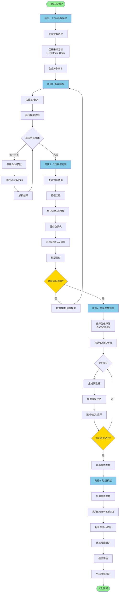
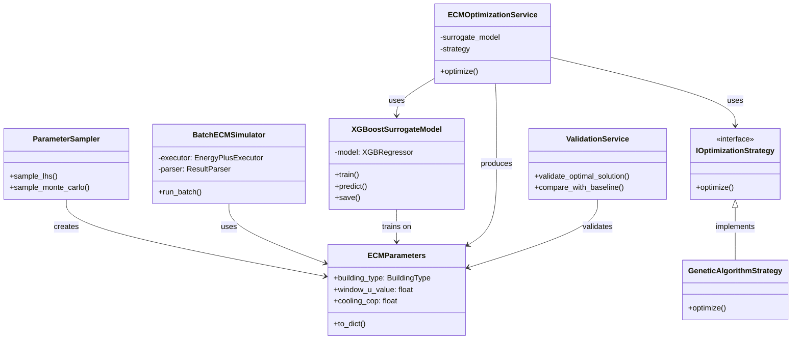

# ECM优化工作流程技术实现文档

## 文档概述

本文档详细描述了基于EnergyPlus的建筑节能改造措施（ECM）优化完整工作流程，包括参数采样、能耗模拟、代理模型构建、最佳参数预测和验证模拟五个核心阶段。

**适用项目**: `/home/pan/code/ep-pipeline`
**技术栈**: Python 3.12+, EnergyPlus, eppy, XGBoost, scikit-learn, joblib
**架构模式**: 领域驱动设计 (DDD)

---

## ⚠️ 重要约束：ECM参数为离散值

**本项目中所有ECM参数均为离散值，不能进行插值或连续采样！**

- ✅ **正确**: 从 `backend/configs/ecm.yaml` 定义的离散选项中选择
- ❌ **错误**: 使用连续LHS采样生成任意浮点数
- ✅ **正确**: 遗传算法使用离散交叉和变异
- ❌ **错误**: 使用高斯变异或混合交叉

**示例**:
```yaml
# backend/configs/ecm.yaml
window_u_value: [0.5, 1, 1.5, 2, 2.5, 3]  # 只能选择这6个值
cooling_cop: [3.5, 4, 4.5, 5, 5.5, 6]     # 只能选择这6个值
```

**全组合空间**: 11个参数共有 **119,439,360** 种离散组合

---

## 目录

1. [工作流程概览](#1-工作流程概览)
2. [ECM参数采样阶段](#2-ecm参数采样阶段)
3. [能耗模拟阶段](#3-能耗模拟阶段)
4. [代理模型构建阶段](#4-代理模型构建阶段)
5. [最佳参数预测阶段](#5-最佳参数预测阶段)
6. [最优参数验证模拟阶段](#6-最优参数验证模拟阶段)
7. [完整示例代码](#7-完整示例代码)
8. [性能优化建议](#8-性能优化建议)

---

## 1. 工作流程概览

### 1.1 整体架构

```
┌─────────────────────────────────────────────────────────────────┐
│                    ECM 优化工作流程                              │
└─────────────────────────────────────────────────────────────────┘
                              │
                              ▼
        ┌──────────────────────────────────────┐
        │  阶段1: ECM参数采样（离散值）         │
        │  - 从离散选项中随机组合采样           │
        │  - 加载 ecm.yaml 定义的离散选项       │
        │  - 生成N组离散参数样本                │
        └──────────────────────────────────────┘
                              │
                              ▼
        ┌──────────────────────────────────────┐
        │  阶段2: 能耗模拟                      │
        │  - 并行执行EnergyPlus模拟             │
        │  - 参数注入到IDF文件                  │
        │  - 收集能耗和成本数据                 │
        └──────────────────────────────────────┘
                              │
                              ▼
        ┌──────────────────────────────────────┐
        │  阶段3: 代理模型构建                  │
        │  - 特征工程和数据预处理               │
        │  - 训练XGBoost/RF/NN模型              │
        │  - 模型验证和精度评估                 │
        └──────────────────────────────────────┘
                              │
                              ▼
        ┌──────────────────────────────────────┐
        │  阶段4: 最佳参数预测                  │
        │  - 遗传算法/贝叶斯优化                │
        │  - 使用代理模型快速评估               │
        │  - 多目标优化 (能耗+成本)             │
        └──────────────────────────────────────┘
                              │
                              ▼
        ┌──────────────────────────────────────┐
        │  阶段5: 最优参数验证模拟              │
        │  - 使用最优参数执行EnergyPlus         │
        │  - 对比代理模型预测值                 │
        │  - 评估节能潜力                       │
        └──────────────────────────────────────┘
```

### 1.2 数据流图

```
参数空间定义 → 采样器 → 参数样本集
                          │
                          ▼
                    ECM应用器 → IDF文件集
                          │
                          ▼
                  EnergyPlus执行器 → 模拟结果集
                          │
                          ▼
                    特征提取器 → 训练数据集
                          │
                          ▼
                    代理模型训练 → 训练好的模型
                          │
                          ▼
                    优化算法 → 最优参数
                          │
                          ▼
                  验证模拟 → 最终结果报告
```

### 1.3 关键技术组件

| 组件 | 实现位置 | 主要功能 |
|------|---------|---------|
| ECMParameters | `backend/domain/models/ecm_parameters.py` | ECM参数值对象 |
| ECMApplicator | `backend/domain/services/ecm_applicator.py` | 将ECM参数应用到IDF |
| EnergyPlusExecutor | `backend/bases/energyplus/executor.py` | 执行EnergyPlus模拟 |
| ResultParser | `backend/services/simulation/result_parser.py` | 解析模拟结果 |
| ParameterSampler | 待实现 | 参数空间采样 |
| SurrogateModel | 待实现 | 代理模型训练和预测 |
| OptimizationStrategy | 待实现 | 优化算法接口 |

---

## 2. ECM参数采样阶段

### 2.1 技术说明

参数采样阶段的目标是在定义的参数空间内生成具有代表性的样本点，用于后续的能耗模拟。

**重要约束**: ECM参数为**离散值**，必须从配置文件 `backend/configs/ecm.yaml` 中定义的选项中选择，**不能进行插值或连续采样**。

例如：
- `window_u_value` 只能取 `[0.5, 1, 1.5, 2, 2.5, 3]` 中的值，不能取 `1.3` 这样的中间值
- `cooling_cop` 只能取 `[3.5, 4, 4.5, 5, 5.5, 6]` 中的值

**采样策略**: 使用**随机组合采样（Random Combinatorial Sampling）**，从每个参数的离散选项列表中随机选择，生成N个样本组合。

**全组合空间大小**:
```
4 (window_shgc) × 6 (window_u_value) × 3 (visible_transmittance) ×
4 (wall_insulation) × 6 (infiltration_rate) × 6 (natural_ventilation_area) ×
6 (cooling_cop) × 6 (heating_cop) × 4 (cooling_air_temperature) ×
4 (heating_air_temperature) × 3 (lighting_power_reduction_level)
= 119,439,360 种组合
```

由于全组合数量巨大，实际使用随机采样选择其中的100-500个组合。

### 2.2 参数空间定义

基于项目配置文件 `backend/configs/ecm.yaml`，定义以下ECM参数：

```yaml
ecm_parameters:
  # 窗户参数
  window_shgc: [0.2, 0.4, 0.6, 0.8]              # 太阳得热系数
  window_u_value: [0.5, 1, 1.5, 2, 2.5, 3]       # 传热系数 W/m²K
  visible_transmittance: [0.4, 0.6, 0.7]         # 可见光透过率
  
  # 围护结构参数
  wall_insulation: [1, 2, 3, 4]                  # 墙体保温 m²K/W
  infiltration_rate: [0.25, 0.5, 0.75, 1, 1.25, 1.5]  # 渗透率 ACH
  
  # 自然通风参数
  natural_ventilation_area: [0.4, 0.8, 1.2, 1.6, 2, 2.4]  # m²
  
  # HVAC系统参数
  cooling_cop: [3.5, 4, 4.5, 5, 5.5, 6]          # 制冷COP
  heating_cop: [3.5, 4, 4.5, 5, 5.5, 6]          # 制热COP
  cooling_air_temperature: [10, 12, 14, 16]      # 制冷送风温度 °C
  heating_air_temperature: [10, 12, 14, 16]      # 制热送风温度 °C
  
  # 照明参数
  lighting_power_reduction_level: [1, 2, 3]      # 照明功率降低等级
```

### 2.3 采样方法实现

#### 2.3.1 拉丁超立方采样器

```python
"""
参数采样器实现（离散值版本）
位置: backend/services/optimization/parameter_sampler.py
"""

from typing import Dict, List
import numpy as np
import yaml
from pathlib import Path
from loguru import logger

from backend.domain.models import ECMParameters, BuildingType


class ParameterSampler:
    """
    ECM参数采样器（离散值版本）

    从配置文件定义的离散选项中随机组合生成ECM参数样本。

    重要: ECM参数为离散值，必须从 backend/configs/ecm.yaml 中定义的选项选择，不能插值。

    Attributes:
        _logger: 日志记录器
        _seed: 随机种子，用于结果可复现
        _ecm_options: 从配置文件加载的ECM参数离散选项
    """

    def __init__(self, config_path: Path = None, seed: int = 42):
        """
        初始化采样器

        Args:
            config_path: ECM配置文件路径，默认为 backend/configs/ecm.yaml
            seed: 随机种子
        """
        self._logger = logger.bind(service=self.__class__.__name__)
        self._seed = seed
        np.random.seed(seed)

        # 加载ECM参数离散选项
        if config_path is None:
            config_path = Path("backend/configs/ecm.yaml")

        with open(config_path, 'r') as f:
            config = yaml.safe_load(f)
            self._ecm_options = config['ecm_parameters']

        self._logger.info(
            f"Loaded ECM options: {len(self._ecm_options)} parameters"
        )
    
    def sample_random_combinations(
        self,
        n_samples: int,
        building_type: BuildingType,
        parameter_subset: List[str] = None
    ) -> List[ECMParameters]:
        """
        随机组合采样（从离散选项中随机选择）

        从每个参数的离散选项列表中随机选择，生成N个样本组合。

        Args:
            n_samples: 采样数量
            building_type: 建筑类型
            parameter_subset: 参数子集（可选），如果指定则只采样这些参数

        Returns:
            ECMParameters对象列表

        Example:
            >>> sampler = ParameterSampler(seed=42)
            >>> samples = sampler.sample_random_combinations(
            ...     n_samples=200,
            ...     building_type=BuildingType.OFFICE_LARGE
            ... )
            >>> len(samples)
            200
            >>> # 验证参数为离散值
            >>> assert samples[0].window_u_value in [0.5, 1, 1.5, 2, 2.5, 3]
            >>> assert samples[0].cooling_cop in [3.5, 4, 4.5, 5, 5.5, 6]
        """
        self._logger.info(
            f"Generating {n_samples} random combination samples "
            f"for building type {building_type}"
        )

        # 确定要采样的参数
        if parameter_subset:
            param_names = parameter_subset
        else:
            param_names = list(self._ecm_options.keys())

        ecm_samples = []

        for i in range(n_samples):
            params_dict = {'building_type': building_type}

            # 从每个参数的离散选项中随机选择
            for param_name in param_names:
                if param_name not in self._ecm_options:
                    self._logger.warning(f"Parameter {param_name} not in config, skipping")
                    continue

                options = self._ecm_options[param_name]
                selected_value = np.random.choice(options)
                params_dict[param_name] = selected_value

            try:
                ecm_params = ECMParameters(**params_dict)
                ecm_samples.append(ecm_params)
            except Exception as e:
                self._logger.warning(
                    f"Invalid parameter combination at sample {i}: {e}"
                )
                continue

        self._logger.success(
            f"Generated {len(ecm_samples)} valid ECM parameter samples"
        )
        return ecm_samples
```

#### 2.3.2 分层采样（确保关键参数均匀覆盖）

```python
    def sample_stratified(
        self,
        n_samples: int,
        building_type: BuildingType,
        stratify_param: str = 'window_u_value'
    ) -> List[ECMParameters]:
        """
        分层采样

        确保某个关键参数的所有离散选项都被均匀采样。

        Args:
            n_samples: 采样数量
            building_type: 建筑类型
            stratify_param: 用于分层的参数名

        Returns:
            ECMParameters对象列表

        Example:
            >>> sampler = ParameterSampler(seed=42)
            >>> # 确保window_u_value的6个选项都被均匀采样
            >>> samples = sampler.sample_stratified(
            ...     n_samples=180,  # 180 = 6 × 30
            ...     building_type=BuildingType.OFFICE_LARGE,
            ...     stratify_param='window_u_value'
            ... )
        """
        self._logger.info(
            f"Generating {n_samples} stratified samples "
            f"stratified by {stratify_param}"
        )

        if stratify_param not in self._ecm_options:
            raise ValueError(f"Parameter {stratify_param} not in ECM options")

        strata_options = self._ecm_options[stratify_param]
        n_strata = len(strata_options)
        samples_per_stratum = n_samples // n_strata

        ecm_samples = []
        param_names = list(self._ecm_options.keys())

        # 对每个层级采样
        for stratum_value in strata_options:
            for _ in range(samples_per_stratum):
                params_dict = {'building_type': building_type}

                for param_name in param_names:
                    if param_name == stratify_param:
                        params_dict[param_name] = stratum_value
                    else:
                        options = self._ecm_options[param_name]
                        params_dict[param_name] = np.random.choice(options)

                try:
                    ecm_params = ECMParameters(**params_dict)
                    ecm_samples.append(ecm_params)
                except Exception as e:
                    self._logger.warning(f"Invalid parameter combination: {e}")
                    continue

        self._logger.success(
            f"Generated {len(ecm_samples)} stratified samples"
        )
        return ecm_samples
```

### 2.4 采样策略配置

```python
"""
采样配置示例
位置: examples/sampling_config.py
"""

# 使用随机组合采样
sampler = ParameterSampler(seed=42)

samples = sampler.sample_random_combinations(
    n_samples=200,
    building_type=BuildingType.OFFICE_LARGE
)

# 或使用分层采样（确保window_u_value的6个选项都被采样）
samples = sampler.sample_stratified(
    n_samples=180,  # 6个选项 × 30个样本/选项
    building_type=BuildingType.OFFICE_LARGE,
    stratify_param='window_u_value'
)
```

### 2.5 输出数据格式

采样阶段输出为ECMParameters对象列表，每个对象包含**离散值**：

```python
# 示例输出（注意所有值都是离散的）
ECMParameters(
    building_type=BuildingType.OFFICE_LARGE,
    window_u_value=1.5,        # 从 [0.5, 1, 1.5, 2, 2.5, 3] 中选择
    window_shgc=0.4,           # 从 [0.2, 0.4, 0.6, 0.8] 中选择
    visible_transmittance=0.6, # 从 [0.4, 0.6, 0.7] 中选择
    wall_insulation=2,         # 从 [1, 2, 3, 4] 中选择
    infiltration_rate=0.75,    # 从 [0.25, 0.5, 0.75, 1, 1.25, 1.5] 中选择
    natural_ventilation_area=1.2,  # 从 [0.4, 0.8, 1.2, 1.6, 2, 2.4] 中选择
    cooling_cop=4.5,           # 从 [3.5, 4, 4.5, 5, 5.5, 6] 中选择
    heating_cop=4.0,           # 从 [3.5, 4, 4.5, 5, 5.5, 6] 中选择
    cooling_air_temperature=12,  # 从 [10, 12, 14, 16] 中选择
    heating_air_temperature=14,  # 从 [10, 12, 14, 16] 中选择
    lighting_power_reduction_level=2  # 从 [1, 2, 3] 中选择
)

# 保存为JSON
samples_json = [sample.to_dict() for sample in samples]
with open('ecm_samples.json', 'w') as f:
    json.dump(samples_json, f, indent=2)
```

---

## 3. 能耗模拟阶段

### 3.1 技术说明

能耗模拟阶段使用EnergyPlus对每组采样参数进行建筑能耗模拟。该阶段的核心是将ECM参数注入到IDF文件中，并行执行模拟，收集能耗、成本等输出指标。

### 3.2 模拟流程架构

```
ECM参数样本 → ECMApplicator → 修改后的IDF → EnergyPlus → 模拟结果
     │              │                │              │            │
     │              │                │              │            ▼
     │              │                │              │      ResultParser
     │              │                │              │            │
     │              │                │              │            ▼
     └──────────────┴────────────────┴──────────────┴──→  训练数据集
```

### 3.3 IDF文件准备和参数注入

#### 3.3.1 ECM应用器使用

项目已实现的`ECMApplicator`负责将ECM参数应用到IDF文件：

```python
"""
使用ECMApplicator应用ECM参数
基于: backend/domain/services/ecm_applicator.py
"""

from pathlib import Path
from eppy.modeleditor import IDF
from backend.domain.services import ECMApplicator
from backend.domain.models import ECMParameters, BuildingType

# 初始化IDD文件（仅需一次）
IDF.setiddname(str(Path("/path/to/Energy+.idd")))

# 加载基准IDF文件
idf = IDF("/path/to/baseline.idf")

# 创建ECM应用器
ecm_applicator = ECMApplicator()

# 定义ECM参数
ecm_params = ECMParameters(
    building_type=BuildingType.OFFICE_LARGE,
    window_u_value=1.5,
    window_shgc=0.4,
    visible_transmittance=0.6,
    wall_insulation=2.0,
    infiltration_rate=0.5,
    natural_ventilation_area=1.0,
    cooling_cop=4.5,
    heating_cop=4.0,
    cooling_air_temperature=12,
    heating_air_temperature=14,
    lighting_power_reduction_level=2
)

# 应用ECM参数到IDF
ecm_applicator.apply(idf, ecm_params)

# 保存修改后的IDF
idf.saveas("/path/to/modified.idf")
```

#### 3.3.2 参数注入详细说明

`ECMApplicator`实现了以下参数注入功能：

| ECM参数 | IDF对象类型 | 修改方法 |
|---------|------------|---------|
| window_u_value, window_shgc | WINDOWMATERIAL:SIMPLEGLAZINGSYSTEM | 创建新材料并替换窗户构造 |
| wall_insulation | Material:NoMass, SurfaceControl:MoveableInsulation | 添加可移动保温层 |
| infiltration_rate | ZONEINFILTRATION:DESIGNFLOWRATE | 修改换气次数 |
| natural_ventilation_area | ZONEVENTILATION:DESIGNFLOWRATE | 修改通风面积 |
| cooling_cop | Coil:Cooling:*, Chiller:* | 修改COP字段 |
| heating_cop | Coil:Heating:*, Boiler:* | 修改效率字段 |
| cooling_air_temperature | SIZING:ZONE | 修改送风温度 |
| heating_air_temperature | SIZING:ZONE | 修改送风温度 |
| lighting_power_reduction_level | LIGHTS | 按比例降低照明功率 |

### 3.4 EnergyPlus执行器

#### 3.4.1 执行器实现

基于项目现有实现 `backend/bases/energyplus/executor.py`：

```python
"""
EnergyPlus执行器使用示例
"""

from pathlib import Path
from backend.bases.energyplus import EnergyPlusExecutor
from backend.domain.models import SimulationContext, SimulationJob, Weather

# 初始化执行器
executor = EnergyPlusExecutor(
    idd_path=Path("/path/to/Energy+.idd")
)

# 创建模拟任务
job = SimulationJob(
    id="ecm_sample_001",
    output_prefix="ecm_001",
    output_directory=Path("output/ecm_samples/001"),
    weather=Weather(
        file_path=Path("/path/to/weather.epw"),
        city="Chicago",
        state="IL"
    ),
    read_variables=True,
    ecm_parameters=ecm_params  # 前面定义的ECM参数
)

# 创建模拟上下文
context = SimulationContext(
    job=job,
    idf=idf  # 已应用ECM参数的IDF对象
)

# 执行模拟
result = executor.run(context)

# 检查结果
if result.success:
    print(f"模拟成功: {result.job_id}")
    print(f"能耗: {result.total_site_energy} kWh")
else:
    print(f"模拟失败: {result.errors}")
```

#### 3.4.2 并行模拟策略

对于大量样本（如500个），使用并行执行提高效率：

```python
"""
并行执行多个ECM模拟
位置: backend/services/optimization/batch_simulator.py
"""

from typing import List
from joblib import Parallel, delayed
from pathlib import Path
from loguru import logger

from backend.domain.models import ECMParameters, SimulationResult
from backend.bases.energyplus import EnergyPlusExecutor
from backend.services.simulation import ResultParser


class BatchECMSimulator:
    """
    批量ECM模拟器

    使用joblib并行执行多个ECM参数组合的EnergyPlus模拟。
    """

    def __init__(
        self,
        executor: EnergyPlusExecutor,
        parser: ResultParser,
        n_jobs: int = 8
    ):
        """
        初始化批量模拟器

        Args:
            executor: EnergyPlus执行器
            parser: 结果解析器
            n_jobs: 并行任务数，-1表示使用所有CPU核心
        """
        self._executor = executor
        self._parser = parser
        self._n_jobs = n_jobs
        self._logger = logger.bind(service=self.__class__.__name__)

    def run_batch(
        self,
        ecm_samples: List[ECMParameters],
        baseline_idf_path: Path,
        weather_file: Path,
        output_base_dir: Path,
    ) -> List[SimulationResult]:
        """
        批量执行ECM模拟

        Args:
            ecm_samples: ECM参数样本列表
            baseline_idf_path: 基准IDF文件路径
            weather_file: 天气文件路径
            output_base_dir: 输出基础目录

        Returns:
            模拟结果列表

        Example:
            >>> simulator = BatchECMSimulator(executor, parser, n_jobs=8)
            >>> results = simulator.run_batch(
            ...     ecm_samples=samples,
            ...     baseline_idf_path=Path("baseline.idf"),
            ...     weather_file=Path("chicago.epw"),
            ...     output_base_dir=Path("output/ecm_batch")
            ... )
        """
        self._logger.info(
            f"Starting batch simulation: {len(ecm_samples)} samples, "
            f"{self._n_jobs} parallel jobs"
        )

        total = len(ecm_samples)

        # 使用joblib并行执行模拟
        results = Parallel(n_jobs=self._n_jobs, verbose=10, backend='loky')(
            delayed(self._run_single_simulation)(
                ecm_params,
                baseline_idf_path,
                weather_file,
                output_base_dir / f"sample_{idx:04d}",
                idx
            )
            for idx, ecm_params in enumerate(ecm_samples)
        )

        # 过滤掉失败的模拟（返回None的情况）
        successful_results = [r for r in results if r is not None]

        self._logger.success(
            f"Batch simulation completed: {len(successful_results)}/{total} successful"
        )
        return successful_results

    def _run_single_simulation(
        self,
        ecm_params: ECMParameters,
        baseline_idf_path: Path,
        weather_file: Path,
        output_dir: Path,
        sample_id: int
    ) -> SimulationResult:
        """
        执行单个ECM模拟

        Args:
            ecm_params: ECM参数
            baseline_idf_path: 基准IDF路径
            weather_file: 天气文件路径
            output_dir: 输出目录
            sample_id: 样本ID

        Returns:
            模拟结果，失败时返回None
        """
        try:
            from eppy.modeleditor import IDF
            from backend.domain.services import ECMApplicator

            # 加载IDF
            idf = IDF(str(baseline_idf_path))

            # 应用ECM参数
            applicator = ECMApplicator()
            applicator.apply(idf, ecm_params)

            # 创建模拟任务
            from backend.domain.models import SimulationJob, Weather

            job = SimulationJob(
                id=f"ecm_sample_{sample_id:04d}",
                output_prefix=f"ecm_{sample_id:04d}",
                output_directory=output_dir,
                weather=Weather(file_path=weather_file),
                read_variables=True,
                ecm_parameters=ecm_params
            )

            # 创建上下文并执行
            from backend.domain.models import SimulationContext

            context = SimulationContext(job=job, idf=idf)
            result = self._executor.run(context)

            # 解析结果
            result = self._parser.parse(result, context)

            return result
        except Exception as e:
            self._logger.error(
                f"Simulation failed for sample {sample_id}: {e}"
            )
            return None
```

### 3.5 模拟输出指标

#### 3.5.1 能耗指标

基于 `backend/services/simulation/result_parser.py`，解析以下能耗指标：

```python
# SimulationResult对象包含的能耗指标
result.total_site_energy          # 总场地能耗 (kWh)
result.total_source_energy        # 总源能耗 (kWh)
result.site_eui                   # 场地EUI (kWh/m²)
result.source_eui                 # 源EUI (kWh/m²)

# 分项能耗
result.heating_energy             # 供暖能耗 (kWh)
result.cooling_energy             # 制冷能耗 (kWh)
result.interior_lighting_energy   # 室内照明能耗 (kWh)
result.interior_equipment_energy  # 室内设备能耗 (kWh)
result.fans_energy                # 风机能耗 (kWh)
result.pumps_energy               # 水泵能耗 (kWh)

# 建筑面积
result.conditioned_floor_area     # 空调面积 (m²)
```

#### 3.5.2 成本指标（可选）

```python
"""
成本计算模块
位置: backend/services/optimization/cost_calculator.py
"""

from typing import Dict
from backend.domain.models import ECMParameters, SimulationResult


class ECMCostCalculator:
    """
    ECM成本计算器

    计算ECM实施的初始投资成本和运行成本。
    """

    # 单位成本数据 (示例值，需根据实际情况调整)
    UNIT_COSTS = {
        'window_replacement': 300,  # $/m²
        'wall_insulation': 50,      # $/m² per R-value
        'hvac_upgrade': 200,        # $/kW
        'lighting_upgrade': 15,     # $/m²
    }

    ENERGY_PRICE = 0.12  # $/kWh

    def calculate_initial_cost(
        self,
        ecm_params: ECMParameters,
        building_area: float,
        baseline_params: ECMParameters
    ) -> float:
        """
        计算ECM初始投资成本

        Args:
            ecm_params: ECM参数
            building_area: 建筑面积 (m²)
            baseline_params: 基准参数

        Returns:
            初始成本 ($)
        """
        cost = 0.0

        # 窗户更换成本
        if (ecm_params.window_u_value != baseline_params.window_u_value or
            ecm_params.window_shgc != baseline_params.window_shgc):
            window_area = building_area * 0.3  # 假设窗墙比30%
            cost += window_area * self.UNIT_COSTS['window_replacement']

        # 墙体保温成本
        if ecm_params.wall_insulation != baseline_params.wall_insulation:
            wall_area = building_area * 0.7
            insulation_diff = (ecm_params.wall_insulation -
                             baseline_params.wall_insulation)
            cost += wall_area * insulation_diff * self.UNIT_COSTS['wall_insulation']

        # HVAC升级成本
        if (ecm_params.cooling_cop != baseline_params.cooling_cop or
            ecm_params.heating_cop != baseline_params.heating_cop):
            hvac_capacity = building_area * 0.1  # 假设100 W/m²
            cost += hvac_capacity * self.UNIT_COSTS['hvac_upgrade']

        # 照明升级成本
        if (ecm_params.lighting_power_reduction_level !=
            baseline_params.lighting_power_reduction_level):
            cost += building_area * self.UNIT_COSTS['lighting_upgrade']

        return cost

    def calculate_annual_operating_cost(
        self,
        result: SimulationResult
    ) -> float:
        """
        计算年运行成本

        Args:
            result: 模拟结果

        Returns:
            年运行成本 ($)
        """
        if result.total_site_energy is None:
            return float('inf')

        return result.total_site_energy * self.ENERGY_PRICE

    def calculate_simple_payback(
        self,
        initial_cost: float,
        baseline_annual_cost: float,
        ecm_annual_cost: float
    ) -> float:
        """
        计算简单投资回收期

        Args:
            initial_cost: 初始投资成本 ($)
            baseline_annual_cost: 基准年运行成本 ($)
            ecm_annual_cost: ECM年运行成本 ($)

        Returns:
            投资回收期 (年)
        """
        annual_savings = baseline_annual_cost - ecm_annual_cost

        if annual_savings <= 0:
            return float('inf')

        return initial_cost / annual_savings
```

### 3.6 错误处理机制

```python
"""
模拟错误处理
"""

class SimulationErrorHandler:
    """处理EnergyPlus模拟错误"""

    @staticmethod
    def handle_simulation_error(
        result: SimulationResult,
        ecm_params: ECMParameters
    ) -> Dict[str, any]:
        """
        处理模拟错误

        Returns:
            错误信息字典，包含错误类型和建议
        """
        error_info = {
            'success': result.success,
            'ecm_params': ecm_params.to_dict(),
            'errors': result.errors,
            'warnings': result.warnings,
            'suggestions': []
        }

        # 分析错误类型
        if not result.success:
            for error in result.errors:
                if 'Severe' in error or 'Fatal' in error:
                    # 严重错误，参数组合可能不合理
                    error_info['suggestions'].append(
                        "参数组合可能导致物理不合理的建筑配置"
                    )

                if 'convergence' in error.lower():
                    # 收敛问题
                    error_info['suggestions'].append(
                        "模拟收敛问题，可能需要调整时间步长或求解器设置"
                    )

        return error_info
```

### 3.7 输出数据格式

模拟阶段输出为训练数据集，格式如下：

```python
# 训练数据示例
training_data = {
    'features': [
        # 每行是一组ECM参数
        [1.5, 0.4, 0.6, 2.0, 0.5, 1.0, 4.5, 4.0, 12, 14, 2],  # 样本1
        [2.0, 0.3, 0.5, 3.0, 0.75, 1.5, 5.0, 4.5, 13, 13, 3], # 样本2
        # ...
    ],
    'targets': {
        'site_eui': [85.2, 78.5, ...],           # kWh/m²
        'source_eui': [120.3, 110.8, ...],       # kWh/m²
        'heating_energy': [45000, 42000, ...],   # kWh
        'cooling_energy': [38000, 35000, ...],   # kWh
        'total_cost': [12500, 11800, ...],       # $
    },
    'metadata': {
        'sample_ids': ['ecm_0000', 'ecm_0001', ...],
        'simulation_status': [True, True, ...],
    }
}
```

---

## 4. 代理模型构建阶段

### 4.1 技术说明

代理模型（Surrogate Model）是一种快速近似模型，用于替代耗时的EnergyPlus模拟。通过在采样数据上训练机器学习模型，可以在优化阶段快速预测不同ECM参数组合的能耗表现。

### 4.2 代理模型类型选择

| 模型类型 | 优点 | 缺点 | 适用场景 |
|---------|------|------|---------|
| **XGBoost** | 精度高、训练快、可解释性好 | 需要调参 | 推荐用于ECM优化 |
| **随机森林** | 鲁棒性强、不易过拟合 | 模型较大 | 参数空间复杂时 |
| **神经网络** | 表达能力强 | 需要大量数据、训练慢 | 大规模数据集 |
| **高斯过程回归** | 提供不确定性估计 | 计算复杂度高 | 小样本、需要置信区间 |
| **支持向量回归** | 泛化能力强 | 参数敏感 | 中小规模数据 |

**推荐方案**: 使用**XGBoost**作为主要代理模型，项目已集成 `xgboost>=3.1.1`。

### 4.3 数据预处理和特征工程

#### 4.3.1 数据准备器

```python
"""
训练数据准备器
位置: backend/services/optimization/data_preparation.py
"""

from typing import Dict, List, Tuple
import numpy as np
import pandas as pd
from sklearn.model_selection import train_test_split
from sklearn.preprocessing import StandardScaler
from loguru import logger

from backend.domain.models import ECMParameters, SimulationResult


class TrainingDataPreparator:
    """
    训练数据准备器

    将ECM参数和模拟结果转换为机器学习训练数据。
    """

    def __init__(self):
        self._logger = logger.bind(service=self.__class__.__name__)
        self._feature_scaler = StandardScaler()
        self._target_scalers = {}

    def prepare_training_data(
        self,
        ecm_samples: List[ECMParameters],
        simulation_results: List[SimulationResult],
        target_variables: List[str] = None,
        test_size: float = 0.2,
        random_state: int = 42
    ) -> Dict[str, np.ndarray]:
        """
        准备训练数据

        Args:
            ecm_samples: ECM参数样本列表
            simulation_results: 模拟结果列表
            target_variables: 目标变量列表，默认为['site_eui', 'source_eui']
            test_size: 测试集比例
            random_state: 随机种子

        Returns:
            包含训练集和测试集的字典

        Example:
            >>> preparator = TrainingDataPreparator()
            >>> data = preparator.prepare_training_data(
            ...     ecm_samples=samples,
            ...     simulation_results=results,
            ...     target_variables=['site_eui', 'total_cost']
            ... )
            >>> X_train = data['X_train']
            >>> y_train = data['y_train']
        """
        if target_variables is None:
            target_variables = ['site_eui', 'source_eui']

        self._logger.info(
            f"Preparing training data: {len(ecm_samples)} samples, "
            f"{len(target_variables)} targets"
        )

        # 提取特征
        features = self._extract_features(ecm_samples)

        # 提取目标变量
        targets = self._extract_targets(simulation_results, target_variables)

        # 过滤失败的模拟
        valid_indices = self._filter_valid_samples(simulation_results)
        features = features[valid_indices]
        targets = {k: v[valid_indices] for k, v in targets.items()}

        self._logger.info(f"Valid samples: {len(valid_indices)}/{len(ecm_samples)}")

        # 划分训练集和测试集
        split_data = {}
        for target_name, target_values in targets.items():
            X_train, X_test, y_train, y_test = train_test_split(
                features,
                target_values,
                test_size=test_size,
                random_state=random_state
            )

            # 特征标准化
            X_train_scaled = self._feature_scaler.fit_transform(X_train)
            X_test_scaled = self._feature_scaler.transform(X_test)

            # 目标变量标准化（可选）
            scaler = StandardScaler()
            y_train_scaled = scaler.fit_transform(y_train.reshape(-1, 1)).flatten()
            y_test_scaled = scaler.transform(y_test.reshape(-1, 1)).flatten()
            self._target_scalers[target_name] = scaler

            split_data[target_name] = {
                'X_train': X_train_scaled,
                'X_test': X_test_scaled,
                'y_train': y_train_scaled,
                'y_test': y_test_scaled,
                'y_train_raw': y_train,
                'y_test_raw': y_test,
            }

        # 添加特征名称
        split_data['feature_names'] = self._get_feature_names()

        self._logger.success("Training data prepared successfully")
        return split_data

    def _extract_features(self, ecm_samples: List[ECMParameters]) -> np.ndarray:
        """
        从ECM参数中提取特征

        Args:
            ecm_samples: ECM参数列表

        Returns:
            特征矩阵 (n_samples, n_features)
        """
        features = []

        for ecm in ecm_samples:
            feature_vector = [
                ecm.window_u_value or 0.0,
                ecm.window_shgc or 0.0,
                ecm.visible_transmittance or 0.0,
                ecm.wall_insulation or 0.0,
                ecm.infiltration_rate or 0.0,
                ecm.natural_ventilation_area or 0.0,
                ecm.cooling_cop or 0.0,
                ecm.heating_cop or 0.0,
                ecm.cooling_air_temperature or 0.0,
                ecm.heating_air_temperature or 0.0,
                ecm.lighting_power_reduction_level or 0,
            ]
            features.append(feature_vector)

        return np.array(features)

    def _extract_targets(
        self,
        results: List[SimulationResult],
        target_variables: List[str]
    ) -> Dict[str, np.ndarray]:
        """
        从模拟结果中提取目标变量

        Args:
            results: 模拟结果列表
            target_variables: 目标变量名称列表

        Returns:
            目标变量字典
        """
        targets = {var: [] for var in target_variables}

        for result in results:
            for var in target_variables:
                value = getattr(result, var, None)
                targets[var].append(value if value is not None else np.nan)

        return {k: np.array(v) for k, v in targets.items()}

    def _filter_valid_samples(
        self,
        results: List[SimulationResult]
    ) -> np.ndarray:
        """
        过滤有效样本

        Args:
            results: 模拟结果列表

        Returns:
            有效样本的索引数组
        """
        valid_indices = []

        for idx, result in enumerate(results):
            if result.success and result.site_eui is not None:
                valid_indices.append(idx)

        return np.array(valid_indices)

    def _get_feature_names(self) -> List[str]:
        """获取特征名称列表"""
        return [
            'window_u_value',
            'window_shgc',
            'visible_transmittance',
            'wall_insulation',
            'infiltration_rate',
            'natural_ventilation_area',
            'cooling_cop',
            'heating_cop',
            'cooling_air_temperature',
            'heating_air_temperature',
            'lighting_power_reduction_level',
        ]
```

### 4.4 代理模型训练

#### 4.4.1 XGBoost模型实现

```python
"""
XGBoost代理模型
位置: backend/services/optimization/surrogate_models.py
"""

from typing import Dict, List, Optional, Tuple
import numpy as np
import xgboost as xgb
from sklearn.metrics import mean_squared_error, r2_score, mean_absolute_error
import joblib
from pathlib import Path
from loguru import logger


class XGBoostSurrogateModel:
    """
    XGBoost代理模型

    使用XGBoost回归器预测ECM参数对应的能耗指标。
    """

    def __init__(
        self,
        n_estimators: int = 100,
        max_depth: int = 6,
        learning_rate: float = 0.1,
        subsample: float = 0.8,
        colsample_bytree: float = 0.8,
        random_state: int = 42
    ):
        """
        初始化XGBoost模型

        Args:
            n_estimators: 树的数量
            max_depth: 树的最大深度
            learning_rate: 学习率
            subsample: 样本采样比例
            colsample_bytree: 特征采样比例
            random_state: 随机种子
        """
        self._logger = logger.bind(model=self.__class__.__name__)

        self._model = xgb.XGBRegressor(
            n_estimators=n_estimators,
            max_depth=max_depth,
            learning_rate=learning_rate,
            subsample=subsample,
            colsample_bytree=colsample_bytree,
            random_state=random_state,
            objective='reg:squarederror',
            tree_method='hist',  # 使用直方图算法加速
            n_jobs=-1  # 使用所有CPU核心
        )

        self._feature_names = None
        self._is_trained = False

    def train(
        self,
        X_train: np.ndarray,
        y_train: np.ndarray,
        X_val: Optional[np.ndarray] = None,
        y_val: Optional[np.ndarray] = None,
        feature_names: Optional[List[str]] = None,
        early_stopping_rounds: int = 10
    ) -> Dict[str, float]:
        """
        训练模型

        Args:
            X_train: 训练特征
            y_train: 训练目标
            X_val: 验证特征（可选）
            y_val: 验证目标（可选）
            feature_names: 特征名称列表
            early_stopping_rounds: 早停轮数

        Returns:
            训练指标字典

        Example:
            >>> model = XGBoostSurrogateModel()
            >>> metrics = model.train(X_train, y_train, X_val, y_val)
            >>> print(f"R² Score: {metrics['r2_score']:.4f}")
        """
        self._logger.info("Training XGBoost surrogate model...")

        self._feature_names = feature_names

        # 准备验证集
        eval_set = [(X_train, y_train)]
        if X_val is not None and y_val is not None:
            eval_set.append((X_val, y_val))

        # 训练模型
        self._model.fit(
            X_train,
            y_train,
            eval_set=eval_set,
            early_stopping_rounds=early_stopping_rounds,
            verbose=False
        )

        self._is_trained = True

        # 计算训练指标
        y_train_pred = self._model.predict(X_train)
        train_metrics = self._calculate_metrics(y_train, y_train_pred, "Train")

        # 计算验证指标
        val_metrics = {}
        if X_val is not None and y_val is not None:
            y_val_pred = self._model.predict(X_val)
            val_metrics = self._calculate_metrics(y_val, y_val_pred, "Validation")

        metrics = {**train_metrics, **val_metrics}

        self._logger.success(
            f"Model trained successfully. "
            f"Train R²: {train_metrics['train_r2']:.4f}, "
            f"Val R²: {val_metrics.get('val_r2', 'N/A')}"
        )

        return metrics

    def predict(self, X: np.ndarray) -> np.ndarray:
        """
        预测

        Args:
            X: 输入特征

        Returns:
            预测值
        """
        if not self._is_trained:
            raise RuntimeError("Model must be trained before prediction")

        return self._model.predict(X)

    def _calculate_metrics(
        self,
        y_true: np.ndarray,
        y_pred: np.ndarray,
        prefix: str
    ) -> Dict[str, float]:
        """
        计算评估指标

        Args:
            y_true: 真实值
            y_pred: 预测值
            prefix: 指标前缀

        Returns:
            指标字典
        """
        mse = mean_squared_error(y_true, y_pred)
        rmse = np.sqrt(mse)
        mae = mean_absolute_error(y_true, y_pred)
        r2 = r2_score(y_true, y_pred)

        # 计算MAPE (Mean Absolute Percentage Error)
        mape = np.mean(np.abs((y_true - y_pred) / y_true)) * 100

        prefix_lower = prefix.lower()
        return {
            f'{prefix_lower}_mse': mse,
            f'{prefix_lower}_rmse': rmse,
            f'{prefix_lower}_mae': mae,
            f'{prefix_lower}_r2': r2,
            f'{prefix_lower}_mape': mape,
        }

    def get_feature_importance(self) -> Dict[str, float]:
        """
        获取特征重要性

        Returns:
            特征重要性字典
        """
        if not self._is_trained:
            raise RuntimeError("Model must be trained first")

        importance = self._model.feature_importances_

        if self._feature_names:
            return dict(zip(self._feature_names, importance))
        else:
            return {f'feature_{i}': imp for i, imp in enumerate(importance)}

    def save(self, path: Path) -> None:
        """
        保存模型

        Args:
            path: 保存路径
        """
        if not self._is_trained:
            raise RuntimeError("Cannot save untrained model")

        model_data = {
            'model': self._model,
            'feature_names': self._feature_names,
        }

        joblib.dump(model_data, path)
        self._logger.info(f"Model saved to {path}")

    def load(self, path: Path) -> None:
        """
        加载模型

        Args:
            path: 模型路径
        """
        model_data = joblib.load(path)

        self._model = model_data['model']
        self._feature_names = model_data['feature_names']
        self._is_trained = True

        self._logger.info(f"Model loaded from {path}")
```

#### 4.4.2 超参数调优

```python
"""
超参数调优
"""

from sklearn.model_selection import GridSearchCV, RandomizedSearchCV
from scipy.stats import uniform, randint


class HyperparameterTuner:
    """
    超参数调优器

    使用网格搜索或随机搜索优化模型超参数。
    """

    def __init__(self, model_class=XGBoostSurrogateModel):
        self._model_class = model_class
        self._logger = logger.bind(service=self.__class__.__name__)

    def tune_xgboost(
        self,
        X_train: np.ndarray,
        y_train: np.ndarray,
        method: str = 'random',
        n_iter: int = 50,
        cv: int = 5
    ) -> Tuple[Dict, XGBoostSurrogateModel]:
        """
        调优XGBoost超参数

        Args:
            X_train: 训练特征
            y_train: 训练目标
            method: 搜索方法 ('grid' 或 'random')
            n_iter: 随机搜索迭代次数
            cv: 交叉验证折数

        Returns:
            (最佳参数, 最佳模型)

        Example:
            >>> tuner = HyperparameterTuner()
            >>> best_params, best_model = tuner.tune_xgboost(
            ...     X_train, y_train, method='random', n_iter=50
            ... )
        """
        self._logger.info(f"Tuning XGBoost hyperparameters using {method} search...")

        # 定义参数空间
        param_distributions = {
            'n_estimators': randint(50, 300),
            'max_depth': randint(3, 10),
            'learning_rate': uniform(0.01, 0.3),
            'subsample': uniform(0.6, 0.4),
            'colsample_bytree': uniform(0.6, 0.4),
            'min_child_weight': randint(1, 10),
            'gamma': uniform(0, 0.5),
        }

        # 创建基础模型
        base_model = xgb.XGBRegressor(
            random_state=42,
            objective='reg:squarederror',
            tree_method='hist',
            n_jobs=-1
        )

        # 选择搜索方法
        if method == 'random':
            search = RandomizedSearchCV(
                base_model,
                param_distributions=param_distributions,
                n_iter=n_iter,
                cv=cv,
                scoring='r2',
                n_jobs=-1,
                verbose=1,
                random_state=42
            )
        else:
            # 网格搜索参数空间（较小）
            param_grid = {
                'n_estimators': [50, 100, 200],
                'max_depth': [3, 6, 9],
                'learning_rate': [0.01, 0.1, 0.3],
                'subsample': [0.7, 0.8, 0.9],
                'colsample_bytree': [0.7, 0.8, 0.9],
            }
            search = GridSearchCV(
                base_model,
                param_grid=param_grid,
                cv=cv,
                scoring='r2',
                n_jobs=-1,
                verbose=1
            )

        # 执行搜索
        search.fit(X_train, y_train)

        best_params = search.best_params_
        best_score = search.best_score_

        self._logger.success(
            f"Best parameters found: {best_params}\n"
            f"Best CV R² score: {best_score:.4f}"
        )

        # 使用最佳参数创建模型
        best_model = XGBoostSurrogateModel(**best_params)

        return best_params, best_model
```

#### 4.4.3 其他代理模型实现

```python
"""
随机森林代理模型
"""

from sklearn.ensemble import RandomForestRegressor


class RandomForestSurrogateModel:
    """
    随机森林代理模型

    使用随机森林回归器作为代理模型。
    """

    def __init__(
        self,
        n_estimators: int = 100,
        max_depth: Optional[int] = None,
        min_samples_split: int = 2,
        min_samples_leaf: int = 1,
        random_state: int = 42
    ):
        self._logger = logger.bind(model=self.__class__.__name__)

        self._model = RandomForestRegressor(
            n_estimators=n_estimators,
            max_depth=max_depth,
            min_samples_split=min_samples_split,
            min_samples_leaf=min_samples_leaf,
            random_state=random_state,
            n_jobs=-1
        )

        self._is_trained = False

    def train(
        self,
        X_train: np.ndarray,
        y_train: np.ndarray
    ) -> Dict[str, float]:
        """训练随机森林模型"""
        self._logger.info("Training Random Forest surrogate model...")

        self._model.fit(X_train, y_train)
        self._is_trained = True

        # 计算训练指标
        y_pred = self._model.predict(X_train)
        r2 = r2_score(y_train, y_pred)
        rmse = np.sqrt(mean_squared_error(y_train, y_pred))

        self._logger.success(f"Model trained. R²: {r2:.4f}, RMSE: {rmse:.4f}")

        return {'r2': r2, 'rmse': rmse}

    def predict(self, X: np.ndarray) -> np.ndarray:
        """预测"""
        if not self._is_trained:
            raise RuntimeError("Model must be trained before prediction")
        return self._model.predict(X)


"""
神经网络代理模型
"""

from sklearn.neural_network import MLPRegressor


class NeuralNetworkSurrogateModel:
    """
    神经网络代理模型

    使用多层感知器(MLP)作为代理模型。
    """

    def __init__(
        self,
        hidden_layer_sizes: Tuple[int, ...] = (100, 50),
        activation: str = 'relu',
        learning_rate_init: float = 0.001,
        max_iter: int = 500,
        random_state: int = 42
    ):
        self._logger = logger.bind(model=self.__class__.__name__)

        self._model = MLPRegressor(
            hidden_layer_sizes=hidden_layer_sizes,
            activation=activation,
            learning_rate_init=learning_rate_init,
            max_iter=max_iter,
            random_state=random_state,
            early_stopping=True,
            validation_fraction=0.1
        )

        self._is_trained = False

    def train(
        self,
        X_train: np.ndarray,
        y_train: np.ndarray
    ) -> Dict[str, float]:
        """训练神经网络模型"""
        self._logger.info("Training Neural Network surrogate model...")

        self._model.fit(X_train, y_train)
        self._is_trained = True

        # 计算训练指标
        y_pred = self._model.predict(X_train)
        r2 = r2_score(y_train, y_pred)
        rmse = np.sqrt(mean_squared_error(y_train, y_pred))

        self._logger.success(f"Model trained. R²: {r2:.4f}, RMSE: {rmse:.4f}")

        return {'r2': r2, 'rmse': rmse}

    def predict(self, X: np.ndarray) -> np.ndarray:
        """预测"""
        if not self._is_trained:
            raise RuntimeError("Model must be trained before prediction")
        return self._model.predict(X)
```

### 4.5 模型验证和精度评估

```python
"""
模型验证器
位置: backend/services/optimization/model_validator.py
"""

import matplotlib.pyplot as plt
from typing import Dict, List
import numpy as np


class SurrogateModelValidator:
    """
    代理模型验证器

    评估代理模型的预测精度和泛化能力。
    """

    def __init__(self):
        self._logger = logger.bind(service=self.__class__.__name__)

    def validate(
        self,
        model,
        X_test: np.ndarray,
        y_test: np.ndarray,
        target_name: str = 'site_eui'
    ) -> Dict[str, float]:
        """
        验证模型

        Args:
            model: 训练好的代理模型
            X_test: 测试特征
            y_test: 测试目标
            target_name: 目标变量名称

        Returns:
            验证指标字典

        Example:
            >>> validator = SurrogateModelValidator()
            >>> metrics = validator.validate(model, X_test, y_test)
            >>> print(f"Test R²: {metrics['r2']:.4f}")
            >>> print(f"Test MAPE: {metrics['mape']:.2f}%")
        """
        self._logger.info(f"Validating model for {target_name}...")

        # 预测
        y_pred = model.predict(X_test)

        # 计算指标
        metrics = {
            'r2': r2_score(y_test, y_pred),
            'rmse': np.sqrt(mean_squared_error(y_test, y_pred)),
            'mae': mean_absolute_error(y_test, y_pred),
            'mape': np.mean(np.abs((y_test - y_pred) / y_test)) * 100,
            'max_error': np.max(np.abs(y_test - y_pred)),
        }

        # 计算预测区间覆盖率
        residuals = y_test - y_pred
        std_residual = np.std(residuals)
        within_1std = np.sum(np.abs(residuals) <= std_residual) / len(residuals)
        within_2std = np.sum(np.abs(residuals) <= 2*std_residual) / len(residuals)

        metrics['within_1std'] = within_1std
        metrics['within_2std'] = within_2std

        self._logger.info(
            f"Validation results for {target_name}:\n"
            f"  R² Score: {metrics['r2']:.4f}\n"
            f"  RMSE: {metrics['rmse']:.4f}\n"
            f"  MAE: {metrics['mae']:.4f}\n"
            f"  MAPE: {metrics['mape']:.2f}%\n"
            f"  Max Error: {metrics['max_error']:.4f}\n"
            f"  Within 1σ: {metrics['within_1std']*100:.1f}%\n"
            f"  Within 2σ: {metrics['within_2std']*100:.1f}%"
        )

        return metrics

    def plot_predictions(
        self,
        y_test: np.ndarray,
        y_pred: np.ndarray,
        target_name: str = 'site_eui',
        save_path: Optional[Path] = None
    ) -> None:
        """
        绘制预测结果对比图

        Args:
            y_test: 真实值
            y_pred: 预测值
            target_name: 目标变量名称
            save_path: 保存路径（可选）
        """
        fig, axes = plt.subplots(1, 2, figsize=(12, 5))

        # 散点图
        axes[0].scatter(y_test, y_pred, alpha=0.5)
        axes[0].plot([y_test.min(), y_test.max()],
                     [y_test.min(), y_test.max()],
                     'r--', lw=2)
        axes[0].set_xlabel('Actual')
        axes[0].set_ylabel('Predicted')
        axes[0].set_title(f'{target_name}: Actual vs Predicted')
        axes[0].grid(True, alpha=0.3)

        # 残差图
        residuals = y_test - y_pred
        axes[1].scatter(y_pred, residuals, alpha=0.5)
        axes[1].axhline(y=0, color='r', linestyle='--', lw=2)
        axes[1].set_xlabel('Predicted')
        axes[1].set_ylabel('Residuals')
        axes[1].set_title(f'{target_name}: Residual Plot')
        axes[1].grid(True, alpha=0.3)

        plt.tight_layout()

        if save_path:
            plt.savefig(save_path, dpi=300, bbox_inches='tight')
            self._logger.info(f"Plot saved to {save_path}")

        plt.close()

    def cross_validate(
        self,
        model_class,
        X: np.ndarray,
        y: np.ndarray,
        cv: int = 5,
        **model_params
    ) -> Dict[str, List[float]]:
        """
        交叉验证

        Args:
            model_class: 模型类
            X: 特征
            y: 目标
            cv: 交叉验证折数
            **model_params: 模型参数

        Returns:
            交叉验证指标字典
        """
        from sklearn.model_selection import KFold

        self._logger.info(f"Performing {cv}-fold cross-validation...")

        kf = KFold(n_splits=cv, shuffle=True, random_state=42)

        cv_scores = {
            'r2': [],
            'rmse': [],
            'mae': [],
            'mape': []
        }

        for fold, (train_idx, val_idx) in enumerate(kf.split(X), 1):
            X_train_fold, X_val_fold = X[train_idx], X[val_idx]
            y_train_fold, y_val_fold = y[train_idx], y[val_idx]

            # 训练模型
            model = model_class(**model_params)
            model.train(X_train_fold, y_train_fold)

            # 验证
            y_pred = model.predict(X_val_fold)

            cv_scores['r2'].append(r2_score(y_val_fold, y_pred))
            cv_scores['rmse'].append(np.sqrt(mean_squared_error(y_val_fold, y_pred)))
            cv_scores['mae'].append(mean_absolute_error(y_val_fold, y_pred))
            cv_scores['mape'].append(
                np.mean(np.abs((y_val_fold - y_pred) / y_val_fold)) * 100
            )

            self._logger.debug(
                f"Fold {fold}: R²={cv_scores['r2'][-1]:.4f}, "
                f"RMSE={cv_scores['rmse'][-1]:.4f}"
            )

        # 计算平均值和标准差
        summary = {}
        for metric, scores in cv_scores.items():
            summary[f'{metric}_mean'] = np.mean(scores)
            summary[f'{metric}_std'] = np.std(scores)

        self._logger.success(
            f"Cross-validation completed:\n"
            f"  R² = {summary['r2_mean']:.4f} ± {summary['r2_std']:.4f}\n"
            f"  RMSE = {summary['rmse_mean']:.4f} ± {summary['rmse_std']:.4f}\n"
            f"  MAE = {summary['mae_mean']:.4f} ± {summary['mae_std']:.4f}\n"
            f"  MAPE = {summary['mape_mean']:.2f}% ± {summary['mape_std']:.2f}%"
        )

        return {**cv_scores, **summary}
```

### 4.6 模型选择和集成

```python
"""
模型集成
"""

class EnsembleSurrogateModel:
    """
    集成代理模型

    组合多个代理模型的预测结果以提高精度。
    """

    def __init__(self, models: List, weights: Optional[List[float]] = None):
        """
        初始化集成模型

        Args:
            models: 模型列表
            weights: 权重列表（可选，默认等权重）
        """
        self._models = models
        self._weights = weights if weights else [1.0/len(models)] * len(models)
        self._logger = logger.bind(model=self.__class__.__name__)

    def predict(self, X: np.ndarray) -> np.ndarray:
        """
        集成预测

        Args:
            X: 输入特征

        Returns:
            加权平均预测值
        """
        predictions = np.array([model.predict(X) for model in self._models])
        weighted_pred = np.average(predictions, axis=0, weights=self._weights)

        return weighted_pred
```

---

## 5. 最佳参数预测阶段

### 5.1 技术说明

最佳参数预测阶段使用优化算法在参数空间中搜索最优的ECM参数组合。通过代理模型快速评估候选解，避免了大量耗时的EnergyPlus模拟。

**重要约束**: 由于ECM参数为**离散值**，优化算法必须：
1. 在离散选项中搜索，不能生成中间值
2. 使用离散优化算法或对连续优化结果进行离散化
3. 验证优化结果是否为有效的离散值

### 5.2 优化算法选择

| 算法 | 优点 | 缺点 | 适用场景 | 离散值支持 |
|------|------|------|---------|-----------|
| **遗传算法(GA)** | 全局搜索能力强、天然支持离散值 | 收敛速度较慢 | 多目标优化、离散参数 | ✅ 原生支持 |
| **贝叶斯优化(BO)** | 样本效率高、适合昂贵函数 | 高维空间性能下降、需要离散化 | 连续参数、小规模优化 | ⚠️ 需要后处理 |
| **粒子群优化(PSO)** | 收敛快、参数少 | 易陷入局部最优、需要离散化 | 连续参数优化 | ⚠️ 需要后处理 |
| **NSGA-II** | 多目标优化、Pareto前沿、支持离散值 | 计算复杂 | 能耗-成本权衡 | ✅ 原生支持 |
| **网格搜索** | 简单、保证找到最优解 | 计算量大 | 小规模离散空间 | ✅ 原生支持 |

**推荐方案**:
- **单目标优化**: 使用**遗传算法(GA)**，天然支持离散参数
- **多目标优化**: 使用**NSGA-II**
- **小规模测试**: 使用**网格搜索**（参数子集）

### 5.3 优化策略接口

```python
"""
优化策略接口
位置: backend/services/optimization/strategies.py
"""

from abc import ABC, abstractmethod
from typing import Callable, Dict, Tuple, Optional, List

from backend.domain.models import ECMParameters, BuildingType


class IOptimizationStrategy(ABC):
    """
    优化策略接口

    定义优化算法的统一接口。
    """

    @abstractmethod
    def optimize(
        self,
        objective_function: Callable[[Dict[str, float]], float],
        parameter_bounds: Dict[str, Tuple[float, float]],
        building_type: BuildingType,
        max_iterations: int = 100,
        constraints: Optional[List[Dict]] = None,
    ) -> Tuple[ECMParameters, float]:
        """
        执行优化

        Args:
            objective_function: 目标函数，接收参数字典，返回目标值（最小化）
            parameter_bounds: 参数边界 {参数名: (最小值, 最大值)}
            building_type: 建筑类型
            max_iterations: 最大迭代次数
            constraints: 约束条件列表（可选）

        Returns:
            (最优ECM参数, 最优目标值)
        """
        pass
```

### 5.4 遗传算法实现

```python
"""
遗传算法优化策略
"""

from deap import base, creator, tools, algorithms
import numpy as np
from loguru import logger


class GeneticAlgorithmStrategy(IOptimizationStrategy):
    """
    遗传算法优化策略（离散值版本）

    使用DEAP库实现的遗传算法，支持离散参数优化。

    Attributes:
        population_size: 种群大小
        crossover_prob: 交叉概率
        mutation_prob: 变异概率
        tournament_size: 锦标赛选择大小
        ecm_options: ECM参数的离散选项
    """

    def __init__(
        self,
        ecm_options: Dict[str, List],
        population_size: int = 100,
        crossover_prob: float = 0.7,
        mutation_prob: float = 0.2,
        tournament_size: int = 3,
        seed: int = 42
    ):
        """
        初始化遗传算法

        Args:
            ecm_options: ECM参数离散选项字典 {参数名: [选项列表]}
            population_size: 种群大小
            crossover_prob: 交叉概率
            mutation_prob: 变异概率
            tournament_size: 锦标赛大小
            seed: 随机种子
        """
        self.population_size = population_size
        self.crossover_prob = crossover_prob
        self.mutation_prob = mutation_prob
        self.tournament_size = tournament_size
        self._ecm_options = ecm_options
        self._seed = seed
        self._logger = logger.bind(strategy=self.__class__.__name__)

        np.random.seed(seed)

    def optimize(
        self,
        objective_function: Callable[[Dict[str, float]], float],
        parameter_bounds: Dict[str, Tuple[float, float]],
        building_type: BuildingType,
        max_iterations: int = 100,
        constraints: Optional[List[Dict]] = None,
    ) -> Tuple[ECMParameters, float]:
        """
        使用遗传算法执行优化

        Args:
            objective_function: 目标函数（最小化）
            parameter_bounds: 参数边界
            building_type: 建筑类型
            max_iterations: 最大代数
            constraints: 约束条件（暂不支持）

        Returns:
            (最优ECM参数, 最优目标值)

        Example:
            >>> def objective(params):
            ...     # 使用代理模型预测
            ...     return surrogate_model.predict([list(params.values())])[0]
            >>>
            >>> strategy = GeneticAlgorithmStrategy(population_size=100)
            >>> bounds = {
            ...     'window_u_value': (0.5, 3.0),
            ...     'cooling_cop': (3.5, 6.0),
            ... }
            >>> optimal_params, optimal_value = strategy.optimize(
            ...     objective, bounds, BuildingType.OFFICE_LARGE, max_iterations=50
            ... )
        """
        self._logger.info(
            f"Starting genetic algorithm optimization: "
            f"{len(parameter_bounds)} parameters, "
            f"population={self.population_size}, "
            f"generations={max_iterations}"
        )

        # 提取参数名和离散选项
        param_names = list(self._ecm_options.keys())
        options_list = [self._ecm_options[name] for name in param_names]

        # 创建DEAP类型
        if hasattr(creator, "FitnessMin"):
            del creator.FitnessMin
        if hasattr(creator, "Individual"):
            del creator.Individual

        creator.create("FitnessMin", base.Fitness, weights=(-1.0,))
        creator.create("Individual", list, fitness=creator.FitnessMin)

        toolbox = base.Toolbox()

        # 注册属性生成器（从离散选项中随机选择）
        for i, options in enumerate(options_list):
            toolbox.register(f"attr_{i}", np.random.choice, options)

        # 创建个体和种群
        def create_individual():
            return creator.Individual([
                getattr(toolbox, f"attr_{i}")()
                for i in range(len(options_list))
            ])

        toolbox.register("individual", create_individual)
        toolbox.register("population", tools.initRepeat, list, toolbox.individual)

        # 评估函数
        def evaluate(individual):
            """评估个体适应度"""
            params_dict = {
                name: value
                for name, value in zip(param_names, individual)
            }

            try:
                fitness = objective_function(params_dict)
                return (fitness,)
            except Exception as e:
                self._logger.warning(f"Evaluation failed: {e}")
                return (float('inf'),)

        toolbox.register("evaluate", evaluate)

        # 遗传算子（离散版本）
        def mate_discrete(ind1, ind2):
            """离散交叉：随机交换基因"""
            for i in range(len(ind1)):
                if np.random.random() < 0.5:
                    ind1[i], ind2[i] = ind2[i], ind1[i]
            return ind1, ind2

        def mutate_discrete(individual, indpb=0.2):
            """离散变异：从选项列表中重新随机选择"""
            for i in range(len(individual)):
                if np.random.random() < indpb:
                    # 从该参数的离散选项中重新随机选择
                    individual[i] = np.random.choice(options_list[i])
            return (individual,)

        toolbox.register("mate", mate_discrete)
        toolbox.register("mutate", mutate_discrete, indpb=0.2)
        toolbox.register("select", tools.selTournament, tournsize=self.tournament_size)

        # 创建初始种群
        population = toolbox.population(n=self.population_size)

        # 统计信息
        stats = tools.Statistics(lambda ind: ind.fitness.values)
        stats.register("avg", np.mean)
        stats.register("std", np.std)
        stats.register("min", np.min)
        stats.register("max", np.max)

        # 记录历史
        history = []

        # 运行遗传算法
        self._logger.info("Running genetic algorithm...")

        for gen in range(max_iterations):
            # 选择
            offspring = toolbox.select(population, len(population))
            offspring = list(map(toolbox.clone, offspring))

            # 交叉
            for child1, child2 in zip(offspring[::2], offspring[1::2]):
                if np.random.random() < self.crossover_prob:
                    toolbox.mate(child1, child2)
                    del child1.fitness.values
                    del child2.fitness.values

            # 变异
            for mutant in offspring:
                if np.random.random() < self.mutation_prob:
                    toolbox.mutate(mutant)
                    del mutant.fitness.values

            # 评估需要重新计算适应度的个体
            invalid_ind = [ind for ind in offspring if not ind.fitness.valid]
            fitnesses = map(toolbox.evaluate, invalid_ind)
            for ind, fit in zip(invalid_ind, fitnesses):
                ind.fitness.values = fit

            # 替换种群
            population[:] = offspring

            # 记录统计信息
            record = stats.compile(population)
            history.append(record)

            if (gen + 1) % 10 == 0:
                self._logger.info(
                    f"Generation {gen+1}/{max_iterations}: "
                    f"Best={record['min']:.4f}, "
                    f"Avg={record['avg']:.4f}"
                )

        # 获取最优个体
        best_individual = tools.selBest(population, k=1)[0]
        best_fitness = best_individual.fitness.values[0]

        # 转换为ECMParameters
        best_params_dict = {
            'building_type': building_type
        }
        for i, param_name in enumerate(param_names):
            best_params_dict[param_name] = float(best_individual[i])

        optimal_params = ECMParameters(**best_params_dict)

        self._logger.success(
            f"Optimization completed. Best fitness: {best_fitness:.4f}\n"
            f"Optimal parameters: {optimal_params.to_dict()}"
        )

        return optimal_params, best_fitness
```

### 5.5 贝叶斯优化实现

```python
"""
贝叶斯优化策略
"""

from bayes_opt import BayesianOptimization


class BayesianOptimizationStrategy(IOptimizationStrategy):
    """
    贝叶斯优化策略

    使用高斯过程回归和采集函数进行优化。
    适合连续参数空间和昂贵的目标函数。
    """

    def __init__(
        self,
        n_init: int = 10,
        acquisition: str = 'ucb',
        kappa: float = 2.576,
        xi: float = 0.0,
        seed: int = 42
    ):
        """
        初始化贝叶斯优化

        Args:
            n_init: 初始随机采样点数
            acquisition: 采集函数类型 ('ucb', 'ei', 'poi')
            kappa: UCB的探索参数
            xi: EI/POI的探索参数
            seed: 随机种子
        """
        self.n_init = n_init
        self.acquisition = acquisition
        self.kappa = kappa
        self.xi = xi
        self._seed = seed
        self._logger = logger.bind(strategy=self.__class__.__name__)

    def optimize(
        self,
        objective_function: Callable[[Dict[str, float]], float],
        parameter_bounds: Dict[str, Tuple[float, float]],
        building_type: BuildingType,
        max_iterations: int = 100,
        constraints: Optional[List[Dict]] = None,
    ) -> Tuple[ECMParameters, float]:
        """
        使用贝叶斯优化执行优化

        Args:
            objective_function: 目标函数（最小化）
            parameter_bounds: 参数边界
            building_type: 建筑类型
            max_iterations: 最大迭代次数
            constraints: 约束条件

        Returns:
            (最优ECM参数, 最优目标值)
        """
        self._logger.info(
            f"Starting Bayesian optimization: "
            f"{len(parameter_bounds)} parameters, "
            f"iterations={max_iterations}"
        )

        # 包装目标函数（贝叶斯优化是最大化，需要取负）
        def wrapped_objective(**params):
            return -objective_function(params)

        # 创建优化器
        optimizer = BayesianOptimization(
            f=wrapped_objective,
            pbounds=parameter_bounds,
            random_state=self._seed,
            verbose=2
        )

        # 执行优化
        optimizer.maximize(
            init_points=self.n_init,
            n_iter=max_iterations - self.n_init,
            acq=self.acquisition,
            kappa=self.kappa,
            xi=self.xi
        )

        # 获取最优结果
        best_params_dict = optimizer.max['params']
        best_params_dict['building_type'] = building_type

        optimal_params = ECMParameters(**best_params_dict)
        optimal_value = -optimizer.max['target']  # 转回最小化

        self._logger.success(
            f"Optimization completed. Best value: {optimal_value:.4f}\n"
            f"Optimal parameters: {optimal_params.to_dict()}"
        )

        return optimal_params, optimal_value
```

### 5.6 多目标优化（NSGA-II）

```python
"""
多目标优化策略
"""

from deap import base, creator, tools, algorithms


class NSGAIIStrategy:
    """
    NSGA-II多目标优化策略

    同时优化多个目标（如能耗和成本），生成Pareto前沿。
    """

    def __init__(
        self,
        population_size: int = 100,
        crossover_prob: float = 0.9,
        mutation_prob: float = 0.1,
        seed: int = 42
    ):
        self.population_size = population_size
        self.crossover_prob = crossover_prob
        self.mutation_prob = mutation_prob
        self._seed = seed
        self._logger = logger.bind(strategy=self.__class__.__name__)

        np.random.seed(seed)

    def optimize(
        self,
        objective_functions: List[Callable[[Dict[str, float]], float]],
        parameter_bounds: Dict[str, Tuple[float, float]],
        building_type: BuildingType,
        max_iterations: int = 100,
    ) -> List[Tuple[ECMParameters, List[float]]]:
        """
        使用NSGA-II执行多目标优化

        Args:
            objective_functions: 目标函数列表（都是最小化）
            parameter_bounds: 参数边界
            building_type: 建筑类型
            max_iterations: 最大代数

        Returns:
            Pareto最优解列表 [(ECM参数, [目标值1, 目标值2, ...])]

        Example:
            >>> def energy_objective(params):
            ...     return energy_model.predict([list(params.values())])[0]
            >>>
            >>> def cost_objective(params):
            ...     return cost_model.predict([list(params.values())])[0]
            >>>
            >>> strategy = NSGAIIStrategy(population_size=100)
            >>> pareto_solutions = strategy.optimize(
            ...     [energy_objective, cost_objective],
            ...     bounds,
            ...     BuildingType.OFFICE_LARGE,
            ...     max_iterations=50
            ... )
        """
        self._logger.info(
            f"Starting NSGA-II optimization: "
            f"{len(objective_functions)} objectives, "
            f"{len(parameter_bounds)} parameters"
        )

        param_names = list(parameter_bounds.keys())
        bounds_list = [parameter_bounds[name] for name in param_names]
        n_objectives = len(objective_functions)

        # 创建DEAP类型
        if hasattr(creator, "FitnessMulti"):
            del creator.FitnessMulti
        if hasattr(creator, "Individual"):
            del creator.Individual

        creator.create("FitnessMulti", base.Fitness, weights=tuple([-1.0] * n_objectives))
        creator.create("Individual", list, fitness=creator.FitnessMulti)

        toolbox = base.Toolbox()

        # 注册生成器
        for i, (low, high) in enumerate(bounds_list):
            toolbox.register(f"attr_{i}", np.random.uniform, low, high)

        def create_individual():
            return creator.Individual([
                getattr(toolbox, f"attr_{i}")()
                for i in range(len(bounds_list))
            ])

        toolbox.register("individual", create_individual)
        toolbox.register("population", tools.initRepeat, list, toolbox.individual)

        # 评估函数
        def evaluate(individual):
            params_dict = {
                name: value
                for name, value in zip(param_names, individual)
            }

            try:
                objectives = [func(params_dict) for func in objective_functions]
                return tuple(objectives)
            except Exception:
                return tuple([float('inf')] * n_objectives)

        toolbox.register("evaluate", evaluate)
        toolbox.register("mate", tools.cxSimulatedBinaryBounded,
                        low=[b[0] for b in bounds_list],
                        up=[b[1] for b in bounds_list],
                        eta=20.0)
        toolbox.register("mutate", tools.mutPolynomialBounded,
                        low=[b[0] for b in bounds_list],
                        up=[b[1] for b in bounds_list],
                        eta=20.0,
                        indpb=1.0/len(bounds_list))
        toolbox.register("select", tools.selNSGA2)

        # 创建初始种群
        population = toolbox.population(n=self.population_size)

        # 运行NSGA-II
        self._logger.info("Running NSGA-II...")

        algorithms.eaMuPlusLambda(
            population,
            toolbox,
            mu=self.population_size,
            lambda_=self.population_size,
            cxpb=self.crossover_prob,
            mutpb=self.mutation_prob,
            ngen=max_iterations,
            verbose=False
        )

        # 提取Pareto前沿
        pareto_front = tools.sortNondominated(population, len(population), first_front_only=True)[0]

        # 转换为ECMParameters
        pareto_solutions = []
        for individual in pareto_front:
            params_dict = {'building_type': building_type}
            for i, param_name in enumerate(param_names):
                params_dict[param_name] = float(individual[i])

            ecm_params = ECMParameters(**params_dict)
            objectives = list(individual.fitness.values)

            pareto_solutions.append((ecm_params, objectives))

        self._logger.success(
            f"Optimization completed. Pareto front size: {len(pareto_solutions)}"
        )

        return pareto_solutions
```

### 5.7 优化服务集成

```python
"""
优化服务
位置: backend/services/optimization/optimization_service.py
"""

from typing import Dict, Tuple, List, Optional
from pathlib import Path
from loguru import logger

from backend.domain.models import ECMParameters, BuildingType
from .strategies import IOptimizationStrategy
from .surrogate_models import XGBoostSurrogateModel


class ECMOptimizationService:
    """
    ECM优化服务

    集成代理模型和优化策略，提供完整的ECM优化功能。
    """

    def __init__(
        self,
        surrogate_model: XGBoostSurrogateModel,
        optimization_strategy: IOptimizationStrategy
    ):
        """
        初始化优化服务

        Args:
            surrogate_model: 训练好的代理模型
            optimization_strategy: 优化策略
        """
        self._surrogate_model = surrogate_model
        self._strategy = optimization_strategy
        self._logger = logger.bind(service=self.__class__.__name__)

    def optimize(
        self,
        parameter_bounds: Dict[str, Tuple[float, float]],
        building_type: BuildingType,
        max_iterations: int = 100,
        target_variable: str = 'site_eui'
    ) -> Tuple[ECMParameters, float]:
        """
        执行ECM优化

        Args:
            parameter_bounds: 参数边界
            building_type: 建筑类型
            max_iterations: 最大迭代次数
            target_variable: 目标变量名称

        Returns:
            (最优ECM参数, 最优目标值)

        Example:
            >>> service = ECMOptimizationService(
            ...     surrogate_model=trained_model,
            ...     optimization_strategy=GeneticAlgorithmStrategy()
            ... )
            >>>
            >>> bounds = {
            ...     'window_u_value': (0.5, 3.0),
            ...     'window_shgc': (0.2, 0.8),
            ...     'cooling_cop': (3.5, 6.0),
            ... }
            >>>
            >>> optimal_params, optimal_eui = service.optimize(
            ...     bounds,
            ...     BuildingType.OFFICE_LARGE,
            ...     max_iterations=50
            ... )
            >>> print(f"Optimal EUI: {optimal_eui:.2f} kWh/m²")
        """
        self._logger.info(
            f"Starting ECM optimization for {target_variable} "
            f"using {type(self._strategy).__name__}"
        )

        # 定义目标函数
        def objective_function(params: Dict[str, float]) -> float:
            """
            目标函数：使用代理模型预测能耗

            Args:
                params: ECM参数字典

            Returns:
                预测的目标值
            """
            # 提取特征向量
            feature_vector = self._params_to_features(params)

            # 使用代理模型预测
            prediction = self._surrogate_model.predict(feature_vector.reshape(1, -1))[0]

            return prediction

        # 执行优化
        optimal_params, optimal_value = self._strategy.optimize(
            objective_function=objective_function,
            parameter_bounds=parameter_bounds,
            building_type=building_type,
            max_iterations=max_iterations
        )

        self._logger.success(
            f"Optimization completed. "
            f"Optimal {target_variable}: {optimal_value:.4f}"
        )

        return optimal_params, optimal_value

    def _params_to_features(self, params: Dict[str, float]) -> np.ndarray:
        """
        将参数字典转换为特征向量

        Args:
            params: 参数字典

        Returns:
            特征向量
        """
        feature_names = [
            'window_u_value',
            'window_shgc',
            'visible_transmittance',
            'wall_insulation',
            'infiltration_rate',
            'natural_ventilation_area',
            'cooling_cop',
            'heating_cop',
            'cooling_air_temperature',
            'heating_air_temperature',
            'lighting_power_reduction_level',
        ]

        features = [params.get(name, 0.0) for name in feature_names]
        return np.array(features)
```

### 5.8 约束条件处理

```python
"""
约束条件处理
"""

class ConstraintHandler:
    """
    约束条件处理器

    处理ECM优化中的各种约束条件。
    """

    @staticmethod
    def check_physical_constraints(params: Dict[str, float]) -> bool:
        """
        检查物理约束

        Args:
            params: ECM参数字典

        Returns:
            是否满足约束
        """
        # 窗户参数约束
        if 'window_u_value' in params and 'window_shgc' in params:
            # U值和SHGC通常负相关
            if params['window_u_value'] < 1.0 and params['window_shgc'] > 0.6:
                return False  # 低U值通常对应低SHGC

        # COP约束
        if 'cooling_cop' in params and 'heating_cop' in params:
            # 制冷COP通常高于制热COP
            if params['heating_cop'] > params['cooling_cop'] + 1.0:
                return False

        # 温度约束
        if 'cooling_air_temperature' in params and 'heating_air_temperature' in params:
            # 制冷送风温度应低于制热送风温度
            if params['cooling_air_temperature'] >= params['heating_air_temperature']:
                return False

        return True

    @staticmethod
    def check_budget_constraint(
        params: Dict[str, float],
        baseline_params: Dict[str, float],
        max_budget: float,
        cost_calculator
    ) -> bool:
        """
        检查预算约束

        Args:
            params: ECM参数字典
            baseline_params: 基准参数字典
            max_budget: 最大预算
            cost_calculator: 成本计算器

        Returns:
            是否满足预算约束
        """
        from backend.domain.models import ECMParameters

        ecm_params = ECMParameters(**params)
        baseline = ECMParameters(**baseline_params)

        initial_cost = cost_calculator.calculate_initial_cost(
            ecm_params,
            building_area=5000,  # 示例面积
            baseline_params=baseline
        )

        return initial_cost <= max_budget
```

---

## 6. 最优参数验证模拟阶段

### 6.1 技术说明

验证模拟阶段使用优化得到的最优ECM参数执行实际的EnergyPlus模拟，验证代理模型的预测精度，并评估实际的节能效果。

### 6.2 验证流程

```
最优ECM参数 → ECMApplicator → 修改IDF → EnergyPlus → 实际结果
                                                          │
                                                          ▼
                                                    与代理模型预测对比
                                                          │
                                                          ▼
                                                    计算节能潜力
```

### 6.3 验证模拟实现

```python
"""
验证模拟服务
位置: backend/services/optimization/validation_service.py
"""

from typing import Dict, Tuple
from pathlib import Path
from loguru import logger

from backend.domain.models import (
    ECMParameters, SimulationResult, SimulationJob,
    SimulationContext, Weather, BuildingType
)
from backend.bases.energyplus import EnergyPlusExecutor
from backend.services.simulation import ResultParser
from backend.domain.services import ECMApplicator


class ValidationService:
    """
    验证模拟服务

    执行最优参数的验证模拟并评估优化效果。
    """

    def __init__(
        self,
        executor: EnergyPlusExecutor,
        parser: ResultParser,
        applicator: ECMApplicator
    ):
        """
        初始化验证服务

        Args:
            executor: EnergyPlus执行器
            parser: 结果解析器
            applicator: ECM应用器
        """
        self._executor = executor
        self._parser = parser
        self._applicator = applicator
        self._logger = logger.bind(service=self.__class__.__name__)

    def validate_optimal_solution(
        self,
        optimal_params: ECMParameters,
        predicted_value: float,
        baseline_idf_path: Path,
        weather_file: Path,
        output_dir: Path,
        target_variable: str = 'site_eui'
    ) -> Dict[str, any]:
        """
        验证最优解

        Args:
            optimal_params: 最优ECM参数
            predicted_value: 代理模型预测值
            baseline_idf_path: 基准IDF路径
            weather_file: 天气文件路径
            output_dir: 输出目录
            target_variable: 目标变量名称

        Returns:
            验证结果字典

        Example:
            >>> validator = ValidationService(executor, parser, applicator)
            >>> validation_result = validator.validate_optimal_solution(
            ...     optimal_params=optimal_params,
            ...     predicted_value=75.5,
            ...     baseline_idf_path=Path("baseline.idf"),
            ...     weather_file=Path("chicago.epw"),
            ...     output_dir=Path("output/validation")
            ... )
            >>> print(f"Prediction error: {validation_result['prediction_error']:.2f}%")
        """
        self._logger.info("Starting validation simulation...")

        # 加载IDF
        from eppy.modeleditor import IDF
        idf = IDF(str(baseline_idf_path))

        # 应用最优ECM参数
        self._applicator.apply(idf, optimal_params)

        # 创建模拟任务
        job = SimulationJob(
            id="validation_optimal",
            output_prefix="optimal",
            output_directory=output_dir,
            weather=Weather(file_path=weather_file),
            read_variables=True,
            ecm_parameters=optimal_params
        )

        # 执行模拟
        context = SimulationContext(job=job, idf=idf)
        result = self._executor.run(context)
        result = self._parser.parse(result, context)

        # 提取实际值
        actual_value = getattr(result, target_variable, None)

        if actual_value is None:
            self._logger.error(f"Failed to get {target_variable} from simulation result")
            return {
                'success': False,
                'error': f'Failed to get {target_variable}'
            }

        # 计算预测误差
        prediction_error = abs(actual_value - predicted_value) / actual_value * 100

        validation_result = {
            'success': True,
            'optimal_params': optimal_params.to_dict(),
            'predicted_value': predicted_value,
            'actual_value': actual_value,
            'prediction_error_percent': prediction_error,
            'simulation_result': result,
        }

        self._logger.success(
            f"Validation completed:\n"
            f"  Predicted {target_variable}: {predicted_value:.4f}\n"
            f"  Actual {target_variable}: {actual_value:.4f}\n"
            f"  Prediction error: {prediction_error:.2f}%"
        )

        return validation_result

    def compare_with_baseline(
        self,
        optimal_result: SimulationResult,
        baseline_result: SimulationResult
    ) -> Dict[str, float]:
        """
        与基准情况对比

        Args:
            optimal_result: 最优方案模拟结果
            baseline_result: 基准方案模拟结果

        Returns:
            对比结果字典
        """
        self._logger.info("Comparing optimal solution with baseline...")

        comparison = {}

        # 能耗对比
        if optimal_result.site_eui and baseline_result.site_eui:
            energy_savings = baseline_result.site_eui - optimal_result.site_eui
            energy_savings_percent = energy_savings / baseline_result.site_eui * 100

            comparison['site_eui_baseline'] = baseline_result.site_eui
            comparison['site_eui_optimal'] = optimal_result.site_eui
            comparison['site_eui_savings'] = energy_savings
            comparison['site_eui_savings_percent'] = energy_savings_percent

        # 分项能耗对比
        energy_components = [
            'heating_energy',
            'cooling_energy',
            'interior_lighting_energy',
            'fans_energy',
            'pumps_energy'
        ]

        for component in energy_components:
            baseline_val = getattr(baseline_result, component, None)
            optimal_val = getattr(optimal_result, component, None)

            if baseline_val and optimal_val:
                savings = baseline_val - optimal_val
                savings_percent = savings / baseline_val * 100

                comparison[f'{component}_baseline'] = baseline_val
                comparison[f'{component}_optimal'] = optimal_val
                comparison[f'{component}_savings'] = savings
                comparison[f'{component}_savings_percent'] = savings_percent

        self._logger.info(
            f"Comparison results:\n"
            f"  Site EUI savings: {comparison.get('site_eui_savings_percent', 0):.2f}%\n"
            f"  Heating savings: {comparison.get('heating_energy_savings_percent', 0):.2f}%\n"
            f"  Cooling savings: {comparison.get('cooling_energy_savings_percent', 0):.2f}%"
        )

        return comparison
```

### 6.4 节能潜力评估

```python
"""
节能潜力评估
"""

class EnergySavingsPotentialEvaluator:
    """
    节能潜力评估器

    评估ECM优化的节能潜力和经济效益。
    """

    def __init__(self, cost_calculator):
        self._cost_calculator = cost_calculator
        self._logger = logger.bind(service=self.__class__.__name__)

    def evaluate(
        self,
        optimal_params: ECMParameters,
        baseline_params: ECMParameters,
        optimal_result: SimulationResult,
        baseline_result: SimulationResult,
        building_area: float,
        electricity_price: float = 0.12,  # $/kWh
        discount_rate: float = 0.05,
        analysis_period: int = 20  # years
    ) -> Dict[str, float]:
        """
        评估节能潜力

        Args:
            optimal_params: 最优ECM参数
            baseline_params: 基准ECM参数
            optimal_result: 最优方案模拟结果
            baseline_result: 基准方案模拟结果
            building_area: 建筑面积 (m²)
            electricity_price: 电价 ($/kWh)
            discount_rate: 折现率
            analysis_period: 分析周期 (年)

        Returns:
            评估结果字典
        """
        self._logger.info("Evaluating energy savings potential...")

        # 计算年能耗节省
        annual_energy_savings = (
            baseline_result.total_site_energy -
            optimal_result.total_site_energy
        )

        # 计算年成本节省
        annual_cost_savings = annual_energy_savings * electricity_price

        # 计算初始投资成本
        initial_cost = self._cost_calculator.calculate_initial_cost(
            optimal_params,
            building_area,
            baseline_params
        )

        # 计算简单投资回收期
        if annual_cost_savings > 0:
            simple_payback = initial_cost / annual_cost_savings
        else:
            simple_payback = float('inf')

        # 计算净现值 (NPV)
        npv = -initial_cost
        for year in range(1, analysis_period + 1):
            npv += annual_cost_savings / ((1 + discount_rate) ** year)

        # 计算内部收益率 (IRR) - 简化计算
        if initial_cost > 0:
            irr = (annual_cost_savings / initial_cost) - discount_rate
        else:
            irr = 0.0

        # 计算生命周期成本节省
        lifecycle_savings = sum([
            annual_cost_savings / ((1 + discount_rate) ** year)
            for year in range(1, analysis_period + 1)
        ])

        evaluation = {
            'annual_energy_savings_kwh': annual_energy_savings,
            'annual_energy_savings_percent': (
                annual_energy_savings / baseline_result.total_site_energy * 100
            ),
            'annual_cost_savings_usd': annual_cost_savings,
            'initial_cost_usd': initial_cost,
            'simple_payback_years': simple_payback,
            'net_present_value_usd': npv,
            'internal_rate_of_return': irr,
            'lifecycle_savings_usd': lifecycle_savings,
            'cost_benefit_ratio': lifecycle_savings / initial_cost if initial_cost > 0 else 0,
        }

        self._logger.success(
            f"Evaluation completed:\n"
            f"  Annual energy savings: {annual_energy_savings:,.0f} kWh "
            f"({evaluation['annual_energy_savings_percent']:.1f}%)\n"
            f"  Annual cost savings: ${annual_cost_savings:,.2f}\n"
            f"  Initial cost: ${initial_cost:,.2f}\n"
            f"  Simple payback: {simple_payback:.1f} years\n"
            f"  NPV: ${npv:,.2f}\n"
            f"  Lifecycle savings: ${lifecycle_savings:,.2f}"
        )

        return evaluation
```

### 6.5 结果报告生成

```python
"""
结果报告生成器
"""

import json
from datetime import datetime


class OptimizationReportGenerator:
    """
    优化结果报告生成器

    生成详细的优化结果报告。
    """

    def generate_report(
        self,
        validation_result: Dict,
        comparison: Dict,
        evaluation: Dict,
        output_path: Path
    ) -> None:
        """
        生成优化报告

        Args:
            validation_result: 验证结果
            comparison: 对比结果
            evaluation: 评估结果
            output_path: 输出路径
        """
        report = {
            'metadata': {
                'generated_at': datetime.now().isoformat(),
                'report_type': 'ECM_Optimization_Results'
            },
            'optimal_parameters': validation_result['optimal_params'],
            'prediction_accuracy': {
                'predicted_value': validation_result['predicted_value'],
                'actual_value': validation_result['actual_value'],
                'error_percent': validation_result['prediction_error_percent']
            },
            'energy_comparison': comparison,
            'economic_evaluation': evaluation,
            'recommendations': self._generate_recommendations(evaluation)
        }

        # 保存JSON报告
        with open(output_path, 'w') as f:
            json.dump(report, f, indent=2)

        # 生成Markdown报告
        md_path = output_path.with_suffix('.md')
        self._generate_markdown_report(report, md_path)

    def _generate_recommendations(self, evaluation: Dict) -> List[str]:
        """生成建议"""
        recommendations = []

        if evaluation['simple_payback_years'] < 5:
            recommendations.append("投资回收期短，强烈推荐实施")
        elif evaluation['simple_payback_years'] < 10:
            recommendations.append("投资回收期适中，建议实施")
        else:
            recommendations.append("投资回收期较长，需谨慎评估")

        if evaluation['net_present_value_usd'] > 0:
            recommendations.append("净现值为正，项目经济可行")
        else:
            recommendations.append("净现值为负，需重新评估参数")

        if evaluation['annual_energy_savings_percent'] > 30:
            recommendations.append("节能效果显著，超过30%")
        elif evaluation['annual_energy_savings_percent'] > 20:
            recommendations.append("节能效果良好，达到20-30%")

        return recommendations

    def _generate_markdown_report(self, report: Dict, output_path: Path) -> None:
        """生成Markdown格式报告"""
        md_content = f"""# ECM优化结果报告

生成时间: {report['metadata']['generated_at']}

## 最优ECM参数

```json
{json.dumps(report['optimal_parameters'], indent=2)}
```

## 代理模型预测精度

- 预测值: {report['prediction_accuracy']['predicted_value']:.2f}
- 实际值: {report['prediction_accuracy']['actual_value']:.2f}
- 预测误差: {report['prediction_accuracy']['error_percent']:.2f}%

## 能耗对比

- 基准EUI: {report['energy_comparison'].get('site_eui_baseline', 'N/A'):.2f} kWh/m²
- 优化后EUI: {report['energy_comparison'].get('site_eui_optimal', 'N/A'):.2f} kWh/m²
- 节能率: {report['energy_comparison'].get('site_eui_savings_percent', 'N/A'):.2f}%

## 经济评估

- 初始投资: ${report['economic_evaluation']['initial_cost_usd']:,.2f}
- 年成本节省: ${report['economic_evaluation']['annual_cost_savings_usd']:,.2f}
- 简单投资回收期: {report['economic_evaluation']['simple_payback_years']:.1f} 年
- 净现值 (NPV): ${report['economic_evaluation']['net_present_value_usd']:,.2f}
- 生命周期节省: ${report['economic_evaluation']['lifecycle_savings_usd']:,.2f}

## 建议

{chr(10).join([f'- {rec}' for rec in report['recommendations']])}
"""

        with open(output_path, 'w', encoding='utf-8') as f:
            f.write(md_content)

```

---

## 7. 完整示例代码

### 7.1 端到端优化流程

```python
"""
完整的ECM优化工作流程示例
位置: examples/ecm_optimization_workflow.py
"""

from pathlib import Path
import numpy as np
from loguru import logger

# 导入项目模块
from backend.domain.models import BuildingType, Weather
from backend.bases.energyplus import EnergyPlusExecutor
from backend.services.simulation import ResultParser
from backend.domain.services import ECMApplicator

# 导入优化模块（待实现）
from backend.services.optimization import (
    ParameterSampler,
    BatchECMSimulator,
    TrainingDataPreparator,
    XGBoostSurrogateModel,
    HyperparameterTuner,
    SurrogateModelValidator,
    GeneticAlgorithmStrategy,
    ECMOptimizationService,
    ValidationService,
    EnergySavingsPotentialEvaluator,
    ECMCostCalculator,
    OptimizationReportGenerator
)


def main():
    """主函数：执行完整的ECM优化工作流程"""

    # ========================================
    # 配置参数
    # ========================================

    # 路径配置
    IDD_PATH = Path("/usr/local/EnergyPlus-23-2-0/Energy+.idd")
    BASELINE_IDF = Path("data/prototypes/chicago_office_large.idf")
    WEATHER_FILE = Path("data/tmys/chicago.epw")
    OUTPUT_BASE = Path("output/ecm_optimization")

    # 建筑类型
    BUILDING_TYPE = BuildingType.OFFICE_LARGE
    BUILDING_AREA = 5000.0  # m²

    # 采样配置
    N_SAMPLES = 200  # 采样数量
    SAMPLING_METHOD = 'random_combinations'  # 随机组合采样（离散值）

    # 优化配置
    MAX_ITERATIONS = 50
    POPULATION_SIZE = 100

    logger.info("=" * 60)
    logger.info("ECM优化工作流程开始")
    logger.info("=" * 60)

    # ========================================
    # 阶段1: ECM参数采样（离散值）
    # ========================================

    logger.info("\n[阶段1] ECM参数采样（从离散选项中随机组合）")

    # 创建采样器（自动从 backend/configs/ecm.yaml 加载离散选项）
    sampler = ParameterSampler(seed=42)

    # 生成样本（从离散选项中随机组合）
    ecm_samples = sampler.sample_random_combinations(
        n_samples=N_SAMPLES,
        building_type=BUILDING_TYPE
    )

    logger.success(f"生成了 {len(ecm_samples)} 个ECM参数样本（所有参数均为离散值）")

    # 验证样本为离散值
    logger.info(f"示例样本: window_u_value={ecm_samples[0].window_u_value} "
                f"(应为 [0.5, 1, 1.5, 2, 2.5, 3] 中的一个)")

    # ========================================
    # 阶段2: 能耗模拟
    # ========================================

    logger.info("\n[阶段2] 批量能耗模拟")

    # 初始化执行器和解析器
    executor = EnergyPlusExecutor(idd_path=IDD_PATH)
    parser = ResultParser()

    # 创建批量模拟器
    batch_simulator = BatchECMSimulator(
        executor=executor,
        parser=parser,
        n_jobs=8  # 使用8个并行任务
    )

    # 执行批量模拟
    simulation_results = batch_simulator.run_batch(
        ecm_samples=ecm_samples,
        baseline_idf_path=BASELINE_IDF,
        weather_file=WEATHER_FILE,
        output_base_dir=OUTPUT_BASE / "simulations"
    )

    logger.success(f"完成 {len(simulation_results)} 个模拟")

    # ========================================
    # 阶段3: 代理模型构建
    # ========================================

    logger.info("\n[阶段3] 代理模型构建")

    # 准备训练数据
    data_preparator = TrainingDataPreparator()
    training_data = data_preparator.prepare_training_data(
        ecm_samples=ecm_samples,
        simulation_results=simulation_results,
        target_variables=['site_eui', 'source_eui'],
        test_size=0.2,
        random_state=42
    )

    # 提取训练集和测试集
    X_train = training_data['site_eui']['X_train']
    y_train = training_data['site_eui']['y_train']
    X_test = training_data['site_eui']['X_test']
    y_test = training_data['site_eui']['y_test']

    logger.info(f"训练集大小: {X_train.shape[0]}, 测试集大小: {X_test.shape[0]}")

    # 超参数调优（可选）
    tuner = HyperparameterTuner()
    best_params, _ = tuner.tune_xgboost(
        X_train, y_train,
        method='random',
        n_iter=30,
        cv=5
    )

    # 训练XGBoost模型
    surrogate_model = XGBoostSurrogateModel(**best_params)
    train_metrics = surrogate_model.train(
        X_train, y_train,
        X_val=X_test, y_val=y_test,
        feature_names=training_data['feature_names'],
        early_stopping_rounds=10
    )

    logger.success(
        f"模型训练完成 - "
        f"训练R²: {train_metrics['train_r2']:.4f}, "
        f"验证R²: {train_metrics['val_r2']:.4f}"
    )

    # 模型验证
    validator = SurrogateModelValidator()
    validation_metrics = validator.validate(
        model=surrogate_model,
        X_test=X_test,
        y_test=y_test,
        target_name='site_eui'
    )

    # 绘制预测结果
    y_pred = surrogate_model.predict(X_test)
    validator.plot_predictions(
        y_test=y_test,
        y_pred=y_pred,
        target_name='site_eui',
        save_path=OUTPUT_BASE / "surrogate_model_validation.png"
    )

    # 保存模型
    surrogate_model.save(OUTPUT_BASE / "surrogate_model.pkl")

    # ========================================
    # 阶段4: 最佳参数预测（离散优化）
    # ========================================

    logger.info("\n[阶段4] 最佳参数预测（使用离散遗传算法）")

    # 创建优化策略（传入离散选项）
    ga_strategy = GeneticAlgorithmStrategy(
        ecm_options=sampler._ecm_options,  # 使用离散选项
        population_size=POPULATION_SIZE,
        crossover_prob=0.7,
        mutation_prob=0.2,
        tournament_size=3,
        seed=42
    )

    # 创建优化服务
    optimization_service = ECMOptimizationService(
        surrogate_model=surrogate_model,
        optimization_strategy=ga_strategy
    )

    # 执行优化
    optimal_params, optimal_eui = optimization_service.optimize(
        building_type=BUILDING_TYPE,
        max_iterations=MAX_ITERATIONS,
        target_variable='site_eui'
    )

    logger.success(
        f"优化完成 - 最优EUI: {optimal_eui:.2f} kWh/m²\n"
        f"最优参数: {optimal_params.to_dict()}"
    )

    # 验证最优参数为离散值
    logger.info("验证最优参数为离散值:")
    logger.info(f"  window_u_value={optimal_params.window_u_value} "
                f"(应在 {sampler._ecm_options['window_u_value']} 中)")
    logger.info(f"  cooling_cop={optimal_params.cooling_cop} "
                f"(应在 {sampler._ecm_options['cooling_cop']} 中)")

    # ========================================
    # 阶段5: 最优参数验证模拟
    # ========================================

    logger.info("\n[阶段5] 最优参数验证模拟")

    # 创建验证服务
    applicator = ECMApplicator()
    validation_service = ValidationService(
        executor=executor,
        parser=parser,
        applicator=applicator
    )

    # 执行验证模拟
    validation_result = validation_service.validate_optimal_solution(
        optimal_params=optimal_params,
        predicted_value=optimal_eui,
        baseline_idf_path=BASELINE_IDF,
        weather_file=WEATHER_FILE,
        output_dir=OUTPUT_BASE / "validation",
        target_variable='site_eui'
    )

    # 运行基准模拟用于对比
    from backend.domain.models import ECMParameters
    baseline_params = ECMParameters(
        building_type=BUILDING_TYPE,
        # 使用默认/基准值
    )

    # 执行基准模拟（简化示例）
    # baseline_result = run_baseline_simulation(...)

    # 对比结果
    # comparison = validation_service.compare_with_baseline(
    #     optimal_result=validation_result['simulation_result'],
    #     baseline_result=baseline_result
    # )

    # 评估节能潜力
    cost_calculator = ECMCostCalculator()
    evaluator = EnergySavingsPotentialEvaluator(cost_calculator)

    # evaluation = evaluator.evaluate(
    #     optimal_params=optimal_params,
    #     baseline_params=baseline_params,
    #     optimal_result=validation_result['simulation_result'],
    #     baseline_result=baseline_result,
    #     building_area=BUILDING_AREA,
    #     electricity_price=0.12,
    #     discount_rate=0.05,
    #     analysis_period=20
    # )

    # 生成报告
    # report_generator = OptimizationReportGenerator()
    # report_generator.generate_report(
    #     validation_result=validation_result,
    #     comparison=comparison,
    #     evaluation=evaluation,
    #     output_path=OUTPUT_BASE / "optimization_report.json"
    # )

    logger.info("=" * 60)
    logger.success("ECM优化工作流程完成！")
    logger.info("=" * 60)


if __name__ == "__main__":
    main()
```

### 7.2 简化版快速示例

```python
"""
简化版ECM优化示例
"""

from pathlib import Path
from backend.services.optimization import quick_optimize_ecm


def quick_example():
    """快速优化示例"""

    # 一键优化
    result = quick_optimize_ecm(
        baseline_idf=Path("baseline.idf"),
        weather_file=Path("chicago.epw"),
        building_type="office_large",
        n_samples=100,
        max_iterations=30,
        output_dir=Path("output/quick_opt")
    )

    print(f"最优EUI: {result['optimal_eui']:.2f} kWh/m²")
    print(f"节能率: {result['energy_savings_percent']:.1f}%")
    print(f"投资回收期: {result['payback_years']:.1f} 年")


if __name__ == "__main__":
    quick_example()
```

---

## 8. 性能优化建议和最佳实践

### 8.1 并行计算优化

#### 8.1.1 EnergyPlus模拟并行化

```python
"""
优化的并行模拟策略
"""

from joblib import Parallel, delayed
from multiprocessing import cpu_count
import psutil


class OptimizedBatchSimulator:
    """
    优化的批量模拟器

    根据系统资源动态调整并行度。
    """

    def __init__(self, executor, parser):
        self._executor = executor
        self._parser = parser

        # 动态确定最优工作进程数
        cpu_cores = cpu_count()
        available_memory_gb = psutil.virtual_memory().available / (1024**3)

        # 每个EnergyPlus进程约需2GB内存
        max_jobs_by_memory = int(available_memory_gb / 2)

        # 取CPU核心数和内存限制的较小值
        self._n_jobs = min(cpu_cores - 1, max_jobs_by_memory, 16)

        logger.info(
            f"Parallel simulation configured: "
            f"{self._n_jobs} parallel jobs "
            f"(CPU cores: {cpu_cores}, Available memory: {available_memory_gb:.1f}GB)"
        )

    def run_batch_optimized(
        self,
        ecm_samples: List[ECMParameters],
        baseline_idf_path: Path,
        weather_file: Path,
        output_base_dir: Path,
        batch_size: int = 100
    ) -> List[SimulationResult]:
        """
        优化的批量模拟

        使用joblib并行处理和进度跟踪。

        Args:
            ecm_samples: ECM参数样本列表
            baseline_idf_path: 基准IDF路径
            weather_file: 天气文件路径
            output_base_dir: 输出基础目录
            batch_size: 批次大小，用于分批处理大量样本

        Returns:
            模拟结果列表
        """
        total_samples = len(ecm_samples)
        results = []

        # 分批处理大量样本
        for batch_start in range(0, total_samples, batch_size):
            batch_end = min(batch_start + batch_size, total_samples)
            batch = ecm_samples[batch_start:batch_end]

            logger.info(
                f"Processing batch {batch_start//batch_size + 1}: "
                f"samples {batch_start+1}-{batch_end}/{total_samples}"
            )

            # 使用joblib并行执行当前批次
            batch_results = Parallel(
                n_jobs=self._n_jobs,
                verbose=10,
                backend='loky',
                timeout=600  # 10分钟超时
            )(
                delayed(self._run_single_simulation)(
                    ecm_params,
                    baseline_idf_path,
                    weather_file,
                    output_base_dir / f"sample_{batch_start + i}",
                    batch_start + i
                )
                for i, ecm_params in enumerate(batch)
            )

            results.extend(batch_results)

        # 过滤失败的模拟
        successful_results = [r for r in results if r is not None]

        logger.info(
            f"Batch simulation completed: "
            f"{len(successful_results)}/{total_samples} successful"
        )

        return successful_results
```

**为什么使用joblib而不是concurrent.futures?**

joblib相比concurrent.futures.ProcessPoolExecutor有以下优势：

1. **更好的内存管理**: joblib使用'loky'后端，提供更好的进程隔离和内存管理
2. **自动序列化优化**: 对NumPy数组和大型对象有更高效的序列化机制
3. **内置进度显示**: 通过`verbose`参数可以直接显示进度
4. **更简洁的API**: 使用`Parallel`和`delayed`的语法更加简洁直观
5. **更好的错误处理**: 提供更详细的错误信息和堆栈跟踪
6. **缓存支持**: 可以使用`Memory`类缓存函数结果，避免重复计算

```python
# joblib示例
from joblib import Parallel, delayed

results = Parallel(n_jobs=8, verbose=10)(
    delayed(simulate)(params) for params in param_list
)

# 等价的concurrent.futures代码更冗长
from concurrent.futures import ProcessPoolExecutor, as_completed

with ProcessPoolExecutor(max_workers=8) as executor:
    futures = [executor.submit(simulate, params) for params in param_list]
    results = [f.result() for f in as_completed(futures)]
```

#### 8.1.2 代理模型训练加速

```python
"""
GPU加速的XGBoost训练
"""

class GPUAcceleratedXGBoost:
    """
    GPU加速的XGBoost模型

    使用GPU加速训练过程。
    """

    def __init__(self, **params):
        # 检测GPU可用性
        try:
            import xgboost as xgb
            gpu_available = xgb.get_config()['use_rmm'] or True
            tree_method = 'gpu_hist' if gpu_available else 'hist'
        except:
            tree_method = 'hist'

        self._model = xgb.XGBRegressor(
            tree_method=tree_method,
            predictor='gpu_predictor' if tree_method == 'gpu_hist' else 'cpu_predictor',
            **params
        )

        logger.info(f"XGBoost using tree_method: {tree_method}")

    def train(self, X_train, y_train, **kwargs):
        """训练模型"""
        self._model.fit(X_train, y_train, **kwargs)
        return self._model
```

### 8.2 内存优化

```python
"""
内存优化策略
"""

class MemoryEfficientDataLoader:
    """
    内存高效的数据加载器

    使用生成器和批处理减少内存占用。
    """

    @staticmethod
    def load_simulation_results_lazy(
        result_dir: Path,
        batch_size: int = 100
    ):
        """
        惰性加载模拟结果

        Args:
            result_dir: 结果目录
            batch_size: 批次大小

        Yields:
            结果批次
        """
        result_files = sorted(result_dir.glob("*/simulation_result.json"))

        batch = []
        for result_file in result_files:
            with open(result_file, 'r') as f:
                result = json.load(f)
                batch.append(result)

            if len(batch) >= batch_size:
                yield batch
                batch = []

        if batch:
            yield batch

    @staticmethod
    def incremental_model_training(
        model,
        data_generator,
        n_batches: int
    ):
        """
        增量模型训练

        Args:
            model: XGBoost模型
            data_generator: 数据生成器
            n_batches: 批次数量
        """
        for batch_idx, (X_batch, y_batch) in enumerate(data_generator):
            logger.info(f"Training on batch {batch_idx + 1}/{n_batches}")

            # XGBoost支持增量训练
            model.fit(
                X_batch, y_batch,
                xgb_model=model if batch_idx > 0 else None
            )
```

### 8.3 缓存和持久化

```python
"""
缓存策略
"""

from functools import lru_cache
import pickle
import hashlib


class SimulationCache:
    """
    模拟结果缓存

    避免重复模拟相同的参数组合。
    """

    def __init__(self, cache_dir: Path):
        self._cache_dir = cache_dir
        self._cache_dir.mkdir(parents=True, exist_ok=True)

    def _get_cache_key(self, ecm_params: ECMParameters) -> str:
        """生成缓存键"""
        params_str = json.dumps(ecm_params.to_dict(), sort_keys=True)
        return hashlib.md5(params_str.encode()).hexdigest()

    def get(self, ecm_params: ECMParameters) -> Optional[SimulationResult]:
        """获取缓存结果"""
        cache_key = self._get_cache_key(ecm_params)
        cache_file = self._cache_dir / f"{cache_key}.pkl"

        if cache_file.exists():
            with open(cache_file, 'rb') as f:
                return pickle.load(f)

        return None

    def set(self, ecm_params: ECMParameters, result: SimulationResult):
        """设置缓存"""
        cache_key = self._get_cache_key(ecm_params)
        cache_file = self._cache_dir / f"{cache_key}.pkl"

        with open(cache_file, 'wb') as f:
            pickle.dump(result, f)

    def clear(self):
        """清空缓存"""
        for cache_file in self._cache_dir.glob("*.pkl"):
            cache_file.unlink()
```

### 8.4 采样策略优化

```python
"""
自适应采样策略
"""

class AdaptiveSampler:
    """
    自适应采样器

    根据模型不确定性动态增加采样点。
    """

    def __init__(self, initial_sampler: ParameterSampler):
        self._sampler = initial_sampler

    def adaptive_sampling(
        self,
        surrogate_model,
        parameter_bounds: Dict[str, Tuple[float, float]],
        building_type: BuildingType,
        n_initial: int = 100,
        n_adaptive: int = 50,
        uncertainty_threshold: float = 0.1
    ) -> List[ECMParameters]:
        """
        自适应采样

        在模型不确定性高的区域增加采样点。

        Args:
            surrogate_model: 代理模型（需支持不确定性估计）
            parameter_bounds: 参数边界
            building_type: 建筑类型
            n_initial: 初始采样数
            n_adaptive: 自适应采样数
            uncertainty_threshold: 不确定性阈值

        Returns:
            采样点列表
        """
        # 初始采样
        initial_samples = self._sampler.sample_lhs(
            parameter_bounds, n_initial, building_type
        )

        # 生成候选点
        candidate_samples = self._sampler.sample_lhs(
            parameter_bounds, n_adaptive * 10, building_type
        )

        # 评估候选点的不确定性
        uncertainties = []
        for sample in candidate_samples:
            # 假设模型支持不确定性估计（如高斯过程）
            # uncertainty = surrogate_model.predict_uncertainty(sample)
            uncertainty = np.random.random()  # 占位符
            uncertainties.append(uncertainty)

        # 选择不确定性最高的点
        high_uncertainty_indices = np.argsort(uncertainties)[-n_adaptive:]
        adaptive_samples = [candidate_samples[i] for i in high_uncertainty_indices]

        return initial_samples + adaptive_samples
```

### 8.5 最佳实践总结

#### 8.5.1 采样阶段（离散值约束）

- ✅ **离散值约束**: ECM参数必须从 `backend/configs/ecm.yaml` 定义的离散选项中选择，**不能插值**
- ✅ **采样方法**: 使用随机组合采样或分层采样，而非连续LHS
- ✅ **采样数量建议**:
  - 小规模测试: 50-100个样本
  - 正常训练: 200-500个样本
  - 大规模训练: 1000+个样本
  - 注意: 全组合空间有119,439,360种组合，采样数量远小于全空间
- ✅ **分层采样**: 对关键参数(如window_u_value)使用分层采样，确保所有离散选项都被覆盖
- ✅ **参数验证**: 采样后验证所有参数值都在离散选项列表中

#### 8.5.2 模拟阶段

- ✅ **并行度设置**: `n_jobs = min(CPU核心数-1, 可用内存GB/2, 16)` (joblib参数)
- ✅ **超时控制**: 设置单个模拟超时(如10分钟),避免卡死
- ✅ **错误处理**: 记录失败的模拟,但不中断整个批次
- ✅ **结果验证**: 检查模拟结果的合理性(如EUI范围)
- ✅ **分批处理**: 大批量模拟分成小批次,便于进度跟踪和错误恢复
- ✅ **后端选择**: joblib使用'loky'后端以获得更好的稳定性和内存管理

#### 8.5.3 代理模型阶段

- ✅ **数据预处理**: 标准化特征,处理异常值
- ✅ **训练集/测试集划分**: 80/20或70/30,使用分层划分
- ✅ **超参数调优**: 使用随机搜索或贝叶斯优化,避免网格搜索
- ✅ **交叉验证**: 5折或10折交叉验证评估模型稳定性
- ✅ **模型选择**: XGBoost通常表现最好,神经网络需要更多数据
- ✅ **精度要求**: R² > 0.9, MAPE < 5% 为优秀; R² > 0.8, MAPE < 10% 为可接受

#### 8.5.4 优化阶段（离散优化）

- ✅ **算法选择（离散值约束）**:
  - **推荐**: 遗传算法(GA) - 天然支持离散参数
  - **推荐**: NSGA-II - 多目标优化，支持离散参数
  - **可选**: 网格搜索 - 仅适用于参数子集（组合数<10000）
  - **不推荐**: 贝叶斯优化(BO) - 需要额外的离散化处理
  - **不推荐**: 粒子群优化(PSO) - 需要额外的离散化处理
- ✅ **遗传算子设计**:
  - 交叉: 使用离散交叉（随机交换基因），不使用混合交叉
  - 变异: 从离散选项列表中重新随机选择，不使用高斯变异
  - 初始化: 从离散选项中随机选择，不使用连续均匀分布
- ✅ **种群大小**: 50-200,参数越多种群越大
- ✅ **迭代次数**: 30-100代,观察收敛曲线
- ✅ **结果验证**: 优化完成后验证所有参数值都在离散选项列表中
- ✅ **多次运行**: 运行3-5次取最优解,避免随机性影响

#### 8.5.5 验证阶段

- ✅ **预测误差**: 代理模型预测误差应<10%
- ✅ **基准对比**: 与未优化的基准情况对比
- ✅ **敏感性分析**: 分析最优解对参数扰动的敏感性
- ✅ **经济评估**: 计算投资回收期、NPV、IRR
- ✅ **不确定性分析**: 考虑电价、折现率等参数的不确定性

#### 8.5.6 工程实践

- ✅ **版本控制**: 记录每次优化的参数、模型、结果
- ✅ **日志记录**: 详细记录每个阶段的执行情况
- ✅ **结果可视化**: 绘制Pareto前沿、参数重要性、收敛曲线
- ✅ **文档化**: 记录假设、限制、决策依据
- ✅ **可重现性**: 固定随机种子,保存环境配置

### 8.6 性能基准

| 阶段 | 样本数 | 并行度 | 预计时间 | 内存需求 |
|------|--------|--------|----------|----------|
| 采样 | 200 | N/A | <1分钟 | <100MB |
| 模拟 | 200 | n_jobs=8 | 2-4小时 | 16GB |
| 训练 | 200 | GPU | 1-5分钟 | 2GB |
| 优化 | 50代 | N/A | 5-10分钟 | <1GB |
| 验证 | 1 | n_jobs=1 | 5-10分钟 | 2GB |
| **总计** | - | - | **3-5小时** | **16GB** |

*注: 基于典型办公建筑,11个ECM参数,8核CPU,无GPU加速,使用joblib并行*

---

## 9. 完整工作流程图

### 9.1 总体架构流程图



### 9.2 数据流图


### 9.3 类图关系



---

## 10. 常见问题和故障排除

### 10.1 模拟阶段问题

**Q1: EnergyPlus模拟失败率高**

A: 检查以下几点:
- ECM参数是否超出合理范围
- IDF文件是否完整有效
- 天气文件是否匹配
- 检查EnergyPlus错误日志

```python
# 添加参数验证
def validate_ecm_params(params: ECMParameters) -> bool:
    if params.window_u_value < 0.5 or params.window_u_value > 5.0:
        return False
    if params.cooling_cop < 2.0 or params.cooling_cop > 8.0:
        return False
    # ... 更多验证
    return True
```

**Q2: 模拟速度太慢**

A: 优化策略:
- 增加并行度 (设置更大的`n_jobs`值，但注意内存限制)
- 使用joblib的'loky'后端以获得更好的性能
- 使用更快的IDF模板
- 减少输出变量
- 使用SSD存储
- 分批处理大量样本以避免内存溢出

### 10.2 代理模型问题

**Q3: 模型精度不足 (R² < 0.8)**

A: 改进方法:
- 增加训练样本数量
- 检查数据质量,移除异常值
- 尝试不同的模型 (Random Forest, Neural Network)
- 增加特征工程 (交互项、多项式特征)
- 调整超参数

**Q4: 模型过拟合**

A: 解决方案:
- 增加正则化 (XGBoost的 `reg_alpha`, `reg_lambda`)
- 减少模型复杂度 (`max_depth`, `n_estimators`)
- 增加训练数据
- 使用交叉验证

### 10.3 优化阶段问题

**Q5: 优化结果不收敛**

A: 调整策略:
- 增加迭代次数
- 调整遗传算法参数 (交叉率、变异率)
- 检查目标函数是否平滑
- 尝试不同的优化算法

**Q6: 优化结果不合理**

A: 检查:
- 参数边界设置是否合理
- 约束条件是否正确
- 代理模型预测是否准确
- 目标函数定义是否正确

### 10.4 验证阶段问题

**Q7: 预测误差过大 (>15%)**

A: 可能原因:
- 最优参数在训练数据分布之外 (外推)
- 代理模型精度不足
- EnergyPlus模拟本身的不确定性

解决方法:
- 扩大采样范围
- 在最优解附近增加采样点
- 使用集成模型提高精度

---

## 11. 扩展和未来改进

### 11.1 多目标优化扩展

```python
"""
扩展到多目标优化
"""

# 同时优化能耗、成本、舒适度
objectives = [
    energy_objective,      # 最小化能耗
    cost_objective,        # 最小化成本
    comfort_objective      # 最大化舒适度
]

nsga2 = NSGAIIStrategy(population_size=100)
pareto_solutions = nsga2.optimize(
    objectives,
    parameter_bounds,
    building_type,
    max_iterations=50
)

# 可视化Pareto前沿
plot_pareto_front(pareto_solutions)
```

### 11.2 在线学习和自适应优化

```python
"""
在线学习: 边优化边更新模型
"""

class OnlineLearningOptimizer:
    """
    在线学习优化器

    在优化过程中动态更新代理模型。
    """

    def optimize_with_online_learning(
        self,
        initial_model,
        parameter_bounds,
        max_iterations: int = 50,
        update_frequency: int = 10
    ):
        """
        在线学习优化

        每隔update_frequency次迭代,用新的模拟数据更新模型。
        """
        model = initial_model

        for iteration in range(max_iterations):
            # 使用当前模型优化
            optimal_params = self._optimize_step(model, parameter_bounds)

            # 执行实际模拟
            actual_result = self._run_simulation(optimal_params)

            # 更新模型
            if iteration % update_frequency == 0:
                model = self._update_model(model, optimal_params, actual_result)

        return optimal_params
```

### 11.3 不确定性量化

```python
"""
不确定性量化
"""

class UncertaintyQuantifier:
    """
    不确定性量化器

    评估优化结果的不确定性。
    """

    def quantify_uncertainty(
        self,
        optimal_params: ECMParameters,
        surrogate_model,
        n_samples: int = 1000
    ):
        """
        蒙特卡洛不确定性量化

        对最优参数进行扰动,评估结果的不确定性。
        """
        results = []

        for _ in range(n_samples):
            # 对参数添加噪声
            perturbed_params = self._perturb_params(optimal_params)

            # 预测
            prediction = surrogate_model.predict(perturbed_params)
            results.append(prediction)

        # 计算统计量
        mean = np.mean(results)
        std = np.std(results)
        ci_95 = (np.percentile(results, 2.5), np.percentile(results, 97.5))

        return {
            'mean': mean,
            'std': std,
            'ci_95': ci_95
        }
```

### 11.4 集成到Web服务

```python
"""
FastAPI Web服务
"""

from fastapi import FastAPI, BackgroundTasks
from pydantic import BaseModel

app = FastAPI()

class OptimizationRequest(BaseModel):
    building_type: str
    baseline_idf_url: str
    weather_file_url: str
    n_samples: int = 100
    max_iterations: int = 50

@app.post("/api/optimize")
async def optimize_ecm(
    request: OptimizationRequest,
    background_tasks: BackgroundTasks
):
    """
    ECM优化API端点
    """
    # 创建优化任务
    task_id = create_optimization_task(request)

    # 后台执行优化
    background_tasks.add_task(
        run_optimization_workflow,
        task_id,
        request
    )

    return {"task_id": task_id, "status": "started"}

@app.get("/api/optimize/{task_id}")
async def get_optimization_status(task_id: str):
    """
    查询优化状态
    """
    status = get_task_status(task_id)
    return status
```

---

## 12. 总结

本文档详细介绍了完整的ECM优化工作流程,包括:

### 12.1 核心技术栈

- **采样**: 拉丁超立方采样 (scipy.stats.qmc)
- **模拟**: EnergyPlus + eppy
- **代理模型**: XGBoost, Random Forest, Neural Network
- **优化**: DEAP (遗传算法), bayes_opt (贝叶斯优化)
- **并行**: joblib (Parallel, delayed)
- **可视化**: matplotlib, seaborn

### 12.2 关键指标

| 指标 | 目标值 | 说明 |
|------|--------|------|
| 代理模型R² | > 0.9 | 优秀; > 0.8 可接受 |
| 预测MAPE | < 5% | 优秀; < 10% 可接受 |
| 验证误差 | < 10% | 代理模型vs实际模拟 |
| 节能率 | > 20% | 相对基准情况 |
| 投资回收期 | < 10年 | 经济可行性 |

### 12.3 实施建议

1. **从小规模开始**: 先用50-100个样本测试流程
2. **逐步扩展**: 验证流程后增加到200-500个样本
3. **持续监控**: 记录每个阶段的性能和精度
4. **迭代改进**: 根据结果调整采样、模型、优化策略
5. **文档化**: 记录所有假设、决策和结果

### 12.4 参考资源

- **EnergyPlus文档**: https://energyplus.net/documentation
- **eppy文档**: https://eppy.readthedocs.io/
- **XGBoost文档**: https://xgboost.readthedocs.io/
- **DEAP文档**: https://deap.readthedocs.io/
- **scikit-learn文档**: https://scikit-learn.org/

### 12.5 项目文件结构

```
ep-pipeline/
├── backend/
│   ├── bases/
│   │   └── energyplus/
│   │       └── executor.py          # EnergyPlus执行器
│   ├── domain/
│   │   ├── models/
│   │   │   └── ecm_parameters.py    # ECM参数模型
│   │   └── services/
│   │       └── ecm_applicator.py    # ECM应用器
│   ├── services/
│   │   ├── simulation/
│   │   │   └── result_parser.py     # 结果解析器
│   │   └── optimization/            # 优化服务 (待实现)
│   │       ├── parameter_sampler.py
│   │       ├── batch_simulator.py
│   │       ├── surrogate_models.py
│   │       ├── strategies.py
│   │       ├── optimization_service.py
│   │       └── validation_service.py
│   └── configs/
│       ├── ecm.yaml                 # ECM配置
│       └── analysis.yaml            # 分析配置
├── docs/
│   └── ECM_OPTIMIZATION_WORKFLOW.md # 本文档
└── examples/
    └── ecm_optimization_workflow.py # 完整示例
```

---

**文档版本**: 1.0
**最后更新**: 2025-11-06
**作者**: EP-Pipeline Team
**联系方式**: [项目仓库](https://github.com/your-repo/ep-pipeline)


